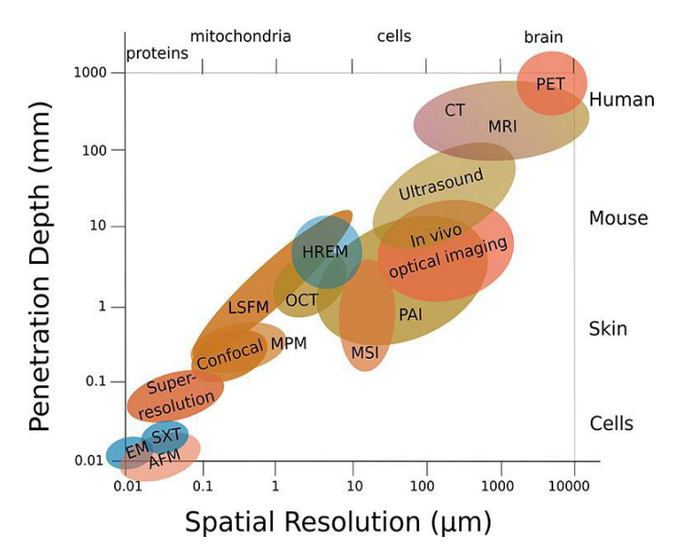

# MRI

## Where does MRI signal come from
The signal in Magnetic Resonance Imaging (MRI) primarily comes from the hydrogen nuclei (protons) within the water and fat molecules in the body. Here’s a detailed look at how these signals are generated and detected:

### 1. **Magnetic Alignment**
When a patient is placed in an MRI scanner, the strong, static magnetic field (denoted as \( B_0 \)) causes the magnetic moments of the hydrogen protons to align either parallel or anti-parallel to the field. This alignment creates a net magnetization vector in the direction of the magnetic field.

### 2. **Excitation by Radiofrequency (RF) Pulse**
A radiofrequency (RF) pulse is then applied at the Larmor frequency specific to hydrogen at the given magnetic field strength. This RF pulse is carefully calibrated to flip the net magnetization vector of the protons from their alignment with \( B_0 \) into the transverse plane (perpendicular to \( B_0 \)). This excitation moves the protons to a higher energy state and out of equilibrium.

### 3. **Relaxation and Emission of RF Signals**
After the RF pulse is turned off, the protons begin to relax back to their lower energy state, realigning with the magnetic field. During this relaxation:

   - **T1 Relaxation (Spin-Lattice Relaxation)**: This is the process by which the net magnetization vector returns to alignment with \( B_0 \). Energy is released to the surrounding lattice (tissue environment).
   - **T2 Relaxation (Spin-Spin Relaxation)**: Simultaneously, the protons lose phase coherence among each other in the transverse plane due to interactions between spins. This dephasing reduces the net transverse magnetization.

As the protons relax, they emit RF signals, which are essentially small bursts of electromagnetic energy. The intensity and characteristics of these signals depend on the tissue properties and the type of protons.

### 4. **Detection of Signals**
The emitted RF signals are detected by receiver coils positioned around the area being imaged. These coils capture the signals and convert them into electrical signals that can be processed by the MRI system's computer.

### 5. **Image Reconstruction**
The electrical signals are digitized and processed using complex mathematical algorithms to reconstruct images. The position of each signal is determined based on the magnetic field gradients applied during the scan, which ensures that each signal can be localized to a specific area within the body.

### 6. **Contrast and Tissue Differentiation**
The characteristics of the MRI signal, such as amplitude and decay rate, vary between different types of tissues due to differences in their T1 and T2 relaxation times. This variation allows MRI to differentiate between various tissue types, fluids, and pathological conditions, providing high-contrast images especially useful for soft tissues.

In summary, the MRI signal originates from the hydrogen protons in the body as they respond to and recover from the excitation by the RF pulse. The ability to detect and analyze these signals makes MRI a powerful tool for medical imaging.

## What the main components of an MRI system are
An MRI (Magnetic Resonance Imaging) system is a complex piece of medical equipment used to create detailed images of the inside of the human body. The system is made up of several main components, each playing a critical role in the imaging process:

### 1. **Main Magnet**
- **Purpose**: The main magnet is responsible for creating a strong, stable magnetic field (\(B_0\)) which is necessary for aligning the magnetic moments of the nuclei (usually hydrogen protons) in the body.
- **Types**: The magnet can be a superconducting magnet, which is the most common type in clinical MRIs due to its ability to produce a very strong magnetic field consistently and efficiently. There are also permanent and resistive electromagnets, though less common due to their lower field strength and stability.

### 2. **Gradient Coils**
- **Purpose**: Gradient coils are used to superimpose additional, variable magnetic fields on top of the main magnetic field. These gradients are critical for spatial encoding of the signals—that is, determining from which part of the body the signals come.
- **Operation**: The coils can alter the magnetic field in a linear gradient along the X, Y, and Z axes of the scanner, which affects the Larmor frequency of the hydrogen protons locally and helps in creating a three-dimensional image.

### 3. **RF (Radiofrequency) Coils**
- **Purpose**: RF coils are used to transmit RF pulses to excite the nuclei and to receive the signals emitted by the nuclei as they relax back to their equilibrium state.
- **Types**: There are transmit coils that specifically send the RF pulse and receive coils that capture the returning signals. In many MRI systems, coils can function as both transmitter and receiver. Specialized coils, like head coils, knee coils, or torso coils, are designed to optimize imaging of specific body parts.

### 4. **RF Transmitter**
- **Purpose**: The RF transmitter generates the RF pulses that are necessary to flip the alignment of the magnetic moments of the nuclei from their equilibrium position.
- **Details**: The transmitter controls the frequency, phase, and amplitude of the pulses, all of which are tuned to match the Larmor frequency of the hydrogen protons for effective resonance.

### 5. **RF Receiver**
- **Purpose**: The RF receiver detects the signals emitted by the excited protons as they relax. These signals are then amplified and converted into digital data that can be processed to form images.
- **Functionality**: The quality of the receiver affects the signal-to-noise ratio and, ultimately, the quality of the MRI images.

### 6. **Patient Table**
- **Purpose**: The patient table is where the patient lies during the MRI scan. It can be moved into and out of the MRI scanner's bore, allowing for precise positioning of the part of the body being imaged.
- **Features**: Modern MRI tables are designed to accommodate patients of varying sizes and to improve comfort, which helps in reducing patient movement and improving image quality.

### 7. **Computer System**
- **Purpose**: The computer system controls the MRI machine and processes the data received from the RF receiver. It converts the signals into images using sophisticated algorithms.
- **Capabilities**: Advanced software in the computer system also allows for the manipulation of imaging parameters, execution of different imaging sequences, and detailed post-processing of images.

### 8. **Cooling System**
- **Purpose**: Especially in systems with superconducting magnets, a cooling system is necessary to maintain the required low temperatures using liquid helium.
- **Function**: Prevents overheating of the components, particularly the main magnet, ensuring efficient and safe operation.

Each component of an MRI system is integral to its function, from creating the initial magnetic alignment of atomic nuclei to capturing and processing the signals that form the images used for diagnosis. The synergy between these components allows for the high-resolution, contrast-rich images that MRI is known for.

## How spatial resolution is realized in MRI
Spatial resolution in Magnetic Resonance Imaging (MRI) is crucial for producing clear and detailed images. It refers to the ability of the MRI system to distinguish between two closely spaced objects. Achieving high spatial resolution involves several factors, primarily related to the MRI scanner's hardware and the scanning parameters set by the operator. Here’s how spatial resolution is realized in MRI:

### 1. **Magnetic Field Strength**
- **Impact**: Higher magnetic field strengths (measured in Tesla, T) generally provide greater signal-to-noise ratio (SNR) and finer spatial resolution. This is because a stronger magnetic field increases the Larmor frequency, leading to greater alignment of spins and therefore a stronger signal.
- **Example**: A 3T magnet typically offers better spatial resolution than a 1.5T magnet, making it preferable for high-resolution brain imaging or small structure analysis.

### 2. **Gradient Coils**
- **Function**: Gradient coils are used to apply varying magnetic fields across the imaging volume. These coils can modify the magnetic field linearly along the X, Y, and Z axes.
- **Role in Spatial Resolution**: By varying the magnetic field slightly across the body, the Larmor frequency of the protons changes slightly with position. This allows for spatial encoding of the MRI signals, where the position of each signal can be accurately determined based on its frequency.

### 3. **RF Coils**
- **Type and Placement**: The design and placement of RF coils can significantly affect spatial resolution. Coils that are closer to the region of interest, such as surface coils or phased array coils, can improve the SNR and spatial resolution of that specific area.
- **Array Coils**: Using multiple coils in an array can improve coverage and enhance the SNR, allowing for higher resolution imaging.

### 4. **Acquisition Parameters**
- **Field of View (FOV)**: The size of the region being imaged. A smaller FOV can be used to increase spatial resolution, provided the area of interest is small.
- **Matrix Size**: This refers to the number of pixels used to represent the image. Increasing the matrix size improves spatial resolution by decreasing the size of each pixel.
- **Slice Thickness**: Thinner slices improve resolution in the slice-selection direction but may reduce the SNR. Balancing slice thickness with the desired resolution and SNR is crucial for optimal imaging.

### 5. **Signal Averaging**
- **Technique**: By averaging the signal obtained from multiple acquisitions, noise can be reduced, enhancing the SNR and potentially improving spatial resolution.
- **Trade-off**: This method increases scan time, which may not be feasible in all clinical situations.

### 6. **Advanced Sequences and Techniques**
- **High-Resolution Protocols**: Techniques like 3D acquisitions, where data is collected in three dimensions and reconstructed, can provide higher resolution compared to traditional 2D slices.
- **Post-Processing**: Software algorithms are also used to improve image quality and resolution after data acquisition. Techniques such as interpolation, filtering, and correction algorithms can enhance the perceived spatial resolution of MRI images.

### 7. **Patient Cooperation**
- **Importance**: Patient movement can degrade image quality and resolution. Ensuring patient comfort and using techniques like motion correction are essential for maintaining high spatial resolution during the scan.

By optimizing these factors, MRI technicians and radiologists can significantly enhance the spatial resolution of MRI scans, enabling detailed visualization of anatomical structures and subtle pathological changes, crucial for accurate diagnosis and treatment planning.

The use of gradient coils to apply magnetic field gradients along the X, Y, and Z axes is central to achieving spatial resolution in MRI. These gradients are crucial for encoding spatial information into the MRI signals from different locations within the body. Here’s how gradients in each of these axes contribute specifically to spatial resolution:

### 1. **Slice Selection Gradient (Z-axis)**
- **Purpose**: The gradient applied along the Z-axis is primarily used for slice selection. This gradient modifies the magnetic field strength linearly along the body's longitudinal axis.
- **Function**: By altering the magnetic field along the Z-axis, the Larmor frequency of the protons varies linearly along this axis. When an RF pulse is applied, only the protons in a specific plane where the RF frequency matches the Larmor frequency will resonate and contribute to the signal. This allows for the selection of a specific slice of tissue to be imaged.
- **Impact on Spatial Resolution**: Adjusting the gradient's steepness can change the thickness of the selected slice. A steeper gradient allows for a thinner slice, which improves the spatial resolution in the slice-select direction by reducing partial volume effects (where signals from adjacent slices might overlap).

### 2. **Frequency Encoding Gradient (X-axis)**
- **Purpose**: Once a slice is selected, the gradient along the X-axis is used for frequency encoding. This gradient is applied during the signal acquisition phase.
- **Function**: By applying a gradient along the X-axis, the magnetic field strength varies linearly across the slice from one side to the other. This causes the Larmor frequency of the protons to vary along the X-axis. As a result, protons at different positions along this axis precess at different frequencies.
- **Impact on Spatial Resolution**: The frequency of the MR signal is used to determine the position of the protons along the X-axis. A stronger gradient leads to a greater frequency difference across the image, which can improve the spatial resolution by allowing for a more precise localization of signal origins along this axis.

### 3. **Phase Encoding Gradient (Y-axis)**
- **Purpose**: The Y-axis gradient is used for phase encoding. This gradient is typically pulsed; it is turned on and off quickly before the signal readout begins.
- **Function**: The application of this gradient temporarily modifies the magnetic field across the Y-axis, causing the spins in different parts of the slice to acquire a phase shift proportional to their position along the Y-axis.
- **Impact on Spatial Resolution**: Each application of the Y-gradient encodes a different phase shift into the spins along this axis. By applying the Y-gradient with varying strengths or durations and then measuring how the phase of the signal varies, the position of the protons along the Y-axis can be determined. More distinct phase encodings (using different gradient strengths or more repetitions) enhance the resolution by differentiating finer positions along the Y-axis.

### Combined Use in Imaging
In practice, the gradients are not used in isolation but are carefully coordinated during an MRI scan:
- **Sequence**: During a typical scan, the Z-gradient first selects a slice. Then, during signal acquisition, the X-gradient is applied continuously for frequency encoding while the Y-gradient is pulsed to vary the phase encoding.
- **Spatial Resolution**: Each of these gradients helps to encode spatial information into the MR signals. By manipulating the strength and timing of these gradients, the MRI system can accurately map where each part of the MR signal comes from within the selected slice, thus defining the spatial resolution across three dimensions.

The precision in controlling these gradients directly impacts the quality and resolution of the resulting MRI images, allowing for detailed visualization of internal structures within the body.

## What Larmor frequency means

The Larmor frequency is a fundamental concept in the field of Magnetic Resonance Imaging (MRI) and other applications involving nuclear magnetic resonance (NMR). It represents the frequency at which the magnetic moments (spins) of nuclei precess (rotate) around an external magnetic field. Here’s a detailed breakdown of this concept:

### Basic Definition
- **Larmor Frequency**: It is the frequency at which the magnetic moments of nuclei, such as hydrogen protons, rotate around the axis of a magnetic field. This rotation is also referred to as precession.

### Formula
The Larmor frequency can be calculated using the following formula:

\[
\omega_L = \gamma \cdot B_0
\]

where:

- \( \omega_L \) is the Larmor frequency,
- \( \gamma \) is the gyromagnetic ratio (a constant that is specific to each type of nucleus and reflects the magnetic moment and angular momentum of the nucleus),
- \( B_0 \) is the strength of the magnetic field.

For example, the gyromagnetic ratio for hydrogen protons is approximately \( 42.58 \) MHz/T (megahertz per tesla), which means that in a 1 Tesla magnetic field, the Larmor frequency of hydrogen protons would be around \( 42.58 \) MHz.

### Significance in MRI
- **Resonance**: In MRI, an RF (radio frequency) pulse is applied at the Larmor frequency of the hydrogen protons in the body. This frequency is carefully chosen to match the Larmor frequency so that the protons absorb the energy efficiently and their spins are flipped from their alignment with the magnetic field. This excitation is crucial for creating the signal that the MRI machine detects and uses to construct images.
- **Image Contrast and Detail**: By manipulating the magnetic field and the frequency of the RF pulses, MRI technicians can enhance different types of tissues based on their magnetic properties, thus adjusting the contrast and details visible in the MRI images.

### Practical Application
In practical MRI settings, the magnetic field strength often varies between different machines, such as 1.5 Tesla, 3 Tesla, or even higher in research and high-end clinical scanners. The Larmor frequency will vary correspondingly, affecting how the MRI system is tuned and the types of RF pulses used.

Understanding and using the Larmor frequency effectively allows MRI practitioners to maximize the efficiency of energy absorption by the protons, manipulate the signal characteristics, and optimize the overall quality of the MRI images for diagnostic purposes.

## What needs to be considered to operate an MRI safely

Operating an MRI (Magnetic Resonance Imaging) scanner safely requires careful consideration of several factors due to the powerful magnetic fields and radiofrequency pulses involved. Here are the key considerations to ensure safety:

### 1. **Magnetic Field Safety**
- **Strong Permanent Magnet**: The main magnet in an MRI scanner is always on, even when no imaging is being conducted. It is crucial to ensure that no ferromagnetic objects are brought into the MRI room because they can become projectiles.
- **Screening for Implants and Devices**: Patients and staff must be thoroughly screened for any metallic implants, pacemakers, cochlear implants, certain types of stents, or other medical devices that might be affected by strong magnetic fields.
- **Personnel and Patient Education**: Both MRI operators and patients should be educated about the risks associated with the magnetic field. This includes information on potential hazards and instructions not to bring metallic objects into the scanning room.

### 2. **Radiofrequency (RF) Field Safety**
- **Heating Effects**: RF fields can cause heating of the body tissues and any metallic implants. It’s important to monitor and control the Specific Absorption Rate (SAR), which measures the rate at which energy is absorbed per unit mass of the body.
- **RF Burns**: Care must be taken to ensure that no loops or coils of wires are present around the patient, as these can concentrate RF energy and lead to burns.

### 3. **Acoustic Noise**
- **Hearing Protection**: The operation of gradient coils can generate significant noise, which can be harmful to hearing. Providing ear protection to patients and staff in the vicinity is essential.
- **Communicating Risks**: Patients should be informed about the noise beforehand and provided with earplugs or other hearing protection devices.

### 4. **Contrast Agent Use**
- **Allergic Reactions and Nephrogenic Systemic Fibrosis (NSF)**: Some MRI scans require intravenous injection of contrast agents (like gadolinium-based contrasts) to enhance image quality. Screening for allergies to contrast materials and understanding the risks associated with renal function are important, as NSF is a severe complication associated with some gadolinium-based agents in patients with renal impairment.
- **Monitoring and Emergency Preparedness**: Facilities should be prepared to manage adverse reactions to contrast agents, including having emergency medications and equipment readily available.

### 5. **Patient Comfort and Anxiety**
- **Communication**: Continuous communication with the patient during the scan is vital to monitor their comfort and manage claustrophobia or anxiety.
- **Support and Reassurance**: Providing support and reassurance, explaining the process beforehand, and using calming techniques can help alleviate anxiety.

### 6. **Emergency Procedures**
- **Rapid Removal Capability**: In case of an emergency, there must be a procedure to quickly remove the patient from the scanner. This often involves a quench button to shut down the magnet in superconducting MRI systems, though this is a last resort due to the damage and cost involved in re-energizing the magnet.
- **Training and Drills**: Staff should be regularly trained and familiar with all emergency procedures, including how to evacuate a patient safely and how to use emergency shutdown systems.

### 7. **Regulatory Compliance**
- **Accreditation and Guidelines**: MRI facilities must comply with relevant health and safety regulations and guidelines provided by health authorities and professional bodies. This includes regular maintenance checks and safety audits.

Ensuring the safety of both the patients and the staff in MRI operations involves managing the unique risks associated with the technology. Proper protocols, training, and equipment are essential for maintaining a safe environment in the powerful magnetic and RF fields used in MRI scanning.

## What relaxation is
In the context of Magnetic Resonance Imaging (MRI), "relaxation" refers to the processes by which atomic nuclei, primarily hydrogen protons in the body, return to their normal energy state after being excited by radiofrequency (RF) pulses in the presence of a magnetic field. There are two primary types of relaxation processes that are crucial to MRI: T1 relaxation and T2 relaxation. Here’s an overview of each:

### 1. **T1 Relaxation (Longitudinal or Spin-Lattice Relaxation)**
- **Definition**: T1 relaxation describes the process by which the net magnetization vector (Mz), aligned along the direction of the magnetic field, returns to its equilibrium state after being disrupted by an RF pulse.
- **Mechanism**: When protons are exposed to an RF pulse, their spins are flipped out of alignment with the magnetic field, creating a higher energy state. T1 relaxation occurs as these protons release this excess energy to their surrounding environment, or "lattice," and realign with the magnetic field. The energy is typically released as heat.
- **Dependence and Measurement**: The rate of T1 relaxation is dependent on the nature of the surrounding lattice and varies among different types of tissues. Fatty tissues generally have shorter T1 times, while fluids like cerebrospinal fluid have longer T1 times. In MRI, T1 relaxation influences the contrast in T1-weighted images, where tissues with shorter T1 times appear brighter.

### 2. **T2 Relaxation (Transverse or Spin-Spin Relaxation)**
- **Definition**: T2 relaxation describes the decay of the transverse component of magnetization (Mxy), perpendicular to the magnetic field. This process involves the dephasing of protons' spins in the transverse plane after the RF pulse is turned off.
- **Mechanism**: Following an RF pulse, protons in the transverse plane initially precess in phase. Over time, interactions among the spins (spin-spin interactions) cause them to lose this coherence, leading to a reduction in the net transverse magnetization. This dephasing is influenced by both intrinsic molecular interactions and local magnetic field inhomogeneities.
- **Dependence and Measurement**: T2 relaxation is also tissue-dependent and is not influenced by the lattice energy but by the intrinsic interactions among spins. In MRI, T2 relaxation affects the contrast in T2-weighted images, with longer T2 times causing tissues to appear brighter.

### 3. **T2* Relaxation**
- **Definition**: T2* relaxation is a related concept that includes both T2 relaxation and additional dephasing caused by inhomogeneities in the external magnetic field, not corrected by the refocusing pulses used in some MRI sequences.
- **Importance**: T2* provides additional contrast mechanisms in certain MRI applications, such as functional MRI (fMRI), where it is used to detect changes in blood oxygen levels.

### Significance in MRI
The different relaxation times (T1, T2, T2*) of tissues are exploited in MRI to generate various types of image contrasts, which can be selectively emphasized by adjusting the MRI scan parameters (like the timing of the RF pulse and the repetition and echo times). This allows radiologists to distinguish between different tissue types and identify abnormalities, providing a powerful tool for medical diagnosis.

## The most important MR sequences
In the context of Magnetic Resonance Imaging (MRI), an MR sequence (or MRI sequence) refers to a specific set of settings and parameters used to acquire images. These sequences determine how the MRI machine excites protons in the body, how it collects signals, and how it processes these signals to form images. Different sequences highlight different types of tissue and pathological conditions. Here’s a breakdown of key concepts related to MR sequences:

### Basic Components of an MR Sequence:

1. **Radiofrequency (RF) Pulses:** These are used to excite the hydrogen protons in the body’s tissues.
2. **Gradient Fields:** Magnetic field gradients are applied to spatially encode the signals.
3. **Timing Parameters:** These include repetition time (TR), echo time (TE), inversion time (TI), and flip angles.
4. **Signal Detection:** The MRI machine detects the emitted signals as the protons relax back to their equilibrium state.

### Common MR Sequences:

1. **Spin Echo (SE) Sequences:**
   - **T1-Weighted Imaging:** Short TR and TE times. Provides high-resolution images of anatomy, with fat appearing bright and water appearing dark.
   - **T2-Weighted Imaging:** Long TR and TE times. Highlights fluid and pathology, with water appearing bright and fat appearing dark.

2. **Gradient Echo (GRE) Sequences:**
   - **T2*-Weighted Imaging:** Sensitive to magnetic field inhomogeneities, useful for detecting hemorrhage and iron deposits.
   - **Fast Imaging:** Provides rapid acquisition times, often used in dynamic studies.

3. **Inversion Recovery (IR) Sequences:**
   - **STIR (Short Tau Inversion Recovery):** Suppresses fat signal, useful in musculoskeletal imaging to highlight edema.
   - **FLAIR (Fluid-Attenuated Inversion Recovery):** Suppresses CSF signal, useful for brain imaging to detect lesions near ventricles.

4. **Echo Planar Imaging (EPI):**
   - **Diffusion-Weighted Imaging (DWI):** Sensitive to the diffusion of water molecules, useful for detecting acute stroke.
   - **Functional MRI (fMRI):** Detects changes in blood oxygenation, used for brain mapping and studying brain activity.

5. **Other Specialized Sequences:**
   - **Magnetic Resonance Angiography (MRA):** Visualizes blood vessels.
   - **Magnetic Resonance Spectroscopy (MRS):** Measures the concentration of specific chemicals in tissues.
   - **Dynamic Contrast-Enhanced MRI (DCE-MRI):** Monitors the passage of contrast agents to assess tissue perfusion and capillary permeability.

### Key Parameters in MR Sequences:

- **Repetition Time (TR):** The time between successive RF pulses.
- **Echo Time (TE):** The time between the RF pulse and the peak of the signal echo.
- **Inversion Time (TI):** The time between an inversion pulse and the excitation pulse in inversion recovery sequences.
- **Flip Angle:** The angle to which the net magnetization vector is rotated during the RF pulse.

### Choosing MR Sequences:

The choice of MR sequence depends on the clinical question and the anatomical region of interest. Radiologists select sequences based on the type of tissue contrast needed, the patient's condition, and the specific diagnostic requirements.

### Summary:

MR sequences are critical in MRI as they determine the contrast and quality of the images produced. Different sequences provide varying levels of detail and contrast for different tissue types and pathological conditions, making MRI a versatile and powerful diagnostic tool in medicine.

MRI sequences are the specific combinations of radiofrequency pulses and gradient applications used during an MRI scan to produce images. Different sequences can provide various types of contrast and are suited for different diagnostic purposes. Here are some of the most important and commonly used MRI sequences:

### 1. **Spin Echo (SE) Sequence**
- **Basic Principle**: The Spin Echo sequence uses an RF pulse followed by a 180-degree refocusing pulse to form an echo.
- **Applications**: It is excellent for producing T1-weighted and T2-weighted images. It’s particularly useful in imaging of the brain, spine, and musculoskeletal system.

### 2. **Gradient Echo (GRE) Sequence**
- **Basic Principle**: Gradient Echo sequences use variable flip angles and do not use a 180-degree refocusing pulse. Instead, they rely on gradient fields to rephase the spins.
- **Applications**: GRE is used for T2*-weighted imaging and is valuable for detecting hemorrhages and vascular abnormalities. It’s also faster than SE and is used in dynamic or functional studies.

### 3. **Inversion Recovery (IR) Sequence**
- **Basic Principle**: This sequence includes an initial 180-degree inversion pulse that flips the magnetization into the opposite direction, followed by a delay (the inversion time, TI) before the standard imaging sequence starts.
- **Applications**: IR sequences are particularly good for enhancing contrast between tissues with different T1 relaxation times. A common variant, the Short TI Inversion Recovery (STIR), is used to suppress fat signals and is helpful in detecting lesions near or within fatty tissues.

### 4. **Fast Spin Echo (FSE) or Turbo Spin Echo (TSE)**
- **Basic Principle**: FSE/TSE sequences are variations of the traditional SE sequence but use multiple 180-degree refocusing pulses to generate several echoes per sequence, reducing scanning time.
- **Applications**: These sequences are used extensively in clinical practice due to their speed and efficiency. They provide excellent T2-weighted images and are widely used in brain, spine, and body imaging.

### 5. **Echo Planar Imaging (EPI)**
- **Basic Principle**: EPI can acquire an entire image or a series of images rapidly using a single RF excitation and multiple gradient echoes.
- **Applications**: EPI is most notably used in functional MRI (fMRI) to measure brain activity, as well as in diffusion-weighted imaging (DWI) for evaluating cellular density or integrity.

### 6. **Diffusion-Weighted Imaging (DWI)**
- **Basic Principle**: DWI measures the random Brownian motion of water molecules within a voxel of tissue, using specific gradients to cause dephasing in areas where water motion is restricted.
- **Applications**: DWI is extremely sensitive to early changes in acute stroke, allowing for the detection of ischemic strokes within minutes of onset. It is also used in the assessment of tumor cellularity and the integrity of white matter tracts in the brain.

### 7. **Magnetization Transfer (MT) Imaging**
- **Basic Principle**: MT sequences apply RF pulses that are off-resonance to saturate macromolecular-bound protons, indirectly affecting the water signal via magnetization transfer.
- **Applications**: MT imaging is used to assess changes in brain tissue and cartilage, providing contrast based on the bound and free water content of tissues.

### 8. **Functional MRI (fMRI)**
- **Basic Principle**: Based on changes in blood flow and oxygenation levels in the brain (BOLD contrast).
- **Applications**: fMRI is used to study brain function, mapping activity by detecting associated changes in blood flow.

Each of these sequences can be optimized with different parameters (like echo time, repetition time, and inversion time) to suit specific diagnostic requirements, providing a versatile and powerful set of tools for medical imaging.

# Optical imaging

## Important optical imaging methods used in preclinical biomedical research

In preclinical biomedical research, optical imaging methods are essential tools for studying diseases, drug effects, and physiological processes in animal models. These methods provide valuable insights due to their high sensitivity, specificity, and ability to provide real-time imaging. Here are several important optical imaging techniques used in preclinical settings:

### 1. **Fluorescence Imaging**
- **Principle:** This technique involves the use of fluorescent dyes or proteins that emit light when excited by a specific wavelength. Fluorescence imaging can be performed in vivo (within a living organism) or ex vivo (outside the organism on extracted samples).
- **Applications:** It is widely used for cellular and molecular imaging, tracking the expression of genes, monitoring the distribution and efficacy of drugs, and visualizing tumor growth and metastasis.

### 2. **Bioluminescence Imaging**
- **Principle:** Bioluminescence imaging utilizes light produced by a chemical reaction within genetically modified organisms that express luciferase enzymes. This method does not require external light excitation, thereby reducing background noise and improving signal-to-noise ratio.
- **Applications:** Commonly used for monitoring disease progression, gene expression, and cell migration in live animals. It is especially useful in cancer research, infectious disease studies, and gene therapy monitoring.

### 3. **Confocal Microscopy**
- **Principle:** Confocal microscopy offers increased optical resolution and contrast by using a spatial pinhole to block out-of-focus light in specimens that are thicker than the focal plane. This allows for the collection of high-resolution images from various depths within a specimen.
- **Applications:** It is particularly useful for detailed 3D imaging of cells and tissues, studying cellular processes, and observing interactions within cellular environments.

### 4. **Multiphoton Microscopy**
- **Principle:** Multiphoton microscopy uses near-infrared excitation light to induce two-photon or multi-photon absorption, which minimizes photodamage and allows deeper tissue penetration. This method provides intrinsic three-dimensional imaging capabilities.
- **Applications:** Ideal for visualizing complex biological processes in vivo, such as neuron activity, deep tissue imaging up to several millimeters, and dynamic blood flow in small vessels.

### 5. **Optical Coherence Tomography (OCT)**
- **Principle:** OCT is an imaging modality that captures micrometer-resolution, three-dimensional images from within optical scattering media (like biological tissue) by measuring the echo time delay and intensity of backscattered light.
- **Applications:** OCT is extensively used in ophthalmology to image the retina, but also in cardiology, oncology, and dermatology for imaging microstructures in tissues.

### 6. **Photoacoustic Imaging**
- **Principle:** This method combines optical and ultrasound imaging technologies. Light absorbed by the tissue generates a small, localized increase in temperature, causing thermal expansion and thus generating ultrasonic waves.
- **Applications:** Used for visualizing vascular structures, studying tumor microenvironments, and mapping biomolecular distributions, with the advantage of deeper tissue penetration than pure optical methods.

### 7. **Total Internal Reflection Fluorescence Microscopy (TIRF)**
- **Principle:** TIRF microscopy uses an evanescent wave that penetrates only a few hundred nanometers into the sample, which reduces background fluorescence and increases contrast.
- **Applications:** This technique is particularly valuable for studying cellular processes that occur near the cell membrane, such as vesicle trafficking, cell adhesion, and receptor-ligand interactions.

These optical imaging methods are integral to preclinical research, enabling detailed study of biological processes in real-time and at cellular and molecular resolutions. They each have specific strengths that make them suitable for particular types of studies, depending on the research needs.

## What specific structures and processes in a cell can be imaged using molecular (optical) imaging techniques

Molecular (optical) imaging techniques offer powerful tools for studying a wide range of cellular structures and processes in high detail. These techniques rely on the use of fluorescent probes, dyes, and advanced microscopy methods to visualize various components and activities within cells. Here are some specific structures and processes that can be imaged using molecular optical imaging techniques:

### 1. **Nucleic Acids (DNA and RNA)**
   - **Fluorescence in situ hybridization (FISH):** Used to detect and localize the presence or absence of specific DNA or RNA sequences in cells.
   - **Confocal microscopy:** Can be used to image DNA in the nucleus or RNA molecules in the process of transcription.

### 2. **Proteins and Enzymes**
   - **Fluorescence microscopy:** Using fluorescent tags like GFP (green fluorescent protein), proteins can be visualized to study their localization, movement, and interaction within the cell.
   - **FRET (Förster Resonance Energy Transfer):** Allows researchers to study protein-protein interactions by detecting energy transfer between closely located fluorophores.

### 3. **Cell Membranes and Membrane Dynamics**
   - **TIRF microscopy (Total Internal Reflection Fluorescence):** Excellent for imaging processes that occur at the cell membrane, such as receptor binding, endocytosis, and exocytosis.
   - **Confocal and multiphoton microscopy:** Used to study the structure and dynamics of lipid membranes.

### 4. **Organelles**
   - **Mitochondria, Golgi apparatus, and Endoplasmic Reticulum:** Fluorescent dyes and proteins can selectively stain these organelles, allowing their morphology and function to be studied in detail.
   - **Live-cell imaging:** Enables real-time tracking of organelle movement, interaction, and response to stimuli.

### 5. **Ion Concentrations and pH Levels**
   - **Fluorescent indicators:** Specific dyes can indicate changes in ions like Ca^2+, Mg^2+, and pH levels within cells, important for understanding cellular signaling and metabolism.

### 6. **Cellular Metabolism**
   - **Fluorescent biosensors:** These can monitor metabolic activities such as glucose uptake, ATP levels, and oxidative stress within cells.

### 7. **Cell Cytoskeleton**
   - **Fluorescent staining:** Actin filaments, microtubules, and intermediate filaments can be stained to visualize cell structure, motility, and division.

### 8. **Cellular Processes**
   - **Apoptosis and necrosis:** Specific markers that change in fluorescence upon apoptotic or necrotic events allow visualization of cell death.
   - **Cell division (mitosis) and proliferation:** Time-lapse fluorescence imaging can track cell cycle progression and division dynamics.

### 9. **Vascular Permeability and Angiogenesis**
   - **Photoacoustic imaging and fluorescence angiography:** Useful for imaging blood vessel growth and function, particularly in cancer research.

### 10. **Intracellular Transport and Trafficking**
   - **Live-cell video microscopy:** Tracks the movement of vesicles and other cargo within cells, important for understanding diseases related to cellular transport like neurodegenerative disorders.

These imaging techniques are crucial in molecular biology, cell biology, and medical research. They help elucidate complex biological mechanisms at the cellular and molecular levels, thereby advancing our understanding of health, disease, and therapeutic intervention strategies.

## What is the purpose of optical imaging in drug development

Optical imaging is a vital tool in drug development, encompassing various techniques such as fluorescence microscopy, bioluminescence imaging, and near-infrared imaging. Here’s how it aids different aspects of drug development:

### 1. Target Visualization
Optical imaging helps visualize the expression and distribution of target molecules within tissues and cells in real time. By using specific fluorescent or bioluminescent markers that bind to target proteins, researchers can directly observe the interaction dynamics between a drug and its target, enhancing understanding of drug action mechanisms.

### 2. Disease Phenotype Characterization
This technology is crucial for studying the progression and regression of disease phenotypes at the molecular and cellular levels. Optical imaging allows for the non-invasive visualization of pathological changes over time, facilitating the assessment of disease models and their response to treatment.

### 3. Efficacy of Drug Candidates
Optical imaging enables the direct observation of a drug’s effect on biological processes in vivo. By tagging drug candidates with optical markers, researchers can monitor the biodistribution and target site accumulation of drugs, helping to determine the optimal dosing regimen and therapeutic potential.

### 4. Safety Evaluation
In safety pharmacology, optical imaging can identify potentially harmful effects of a drug candidate by monitoring changes in cellular function and tissue health. This can include checking for signs of apoptosis, necrosis, or changes in metabolic activity in response to drug exposure.

### 5. Pharmacokinetics
Optical imaging techniques allow the real-time tracking of drugs within the body. By labeling drug molecules with fluorescent or bioluminescent tags, researchers can observe how drugs are absorbed, distributed, metabolized, and excreted—critical factors in drug design and dosing.

### 6. Identification & Validation of Biomarkers
Optical imaging is key in biomarker discovery and validation. By using specific markers that light up under optical imaging, researchers can identify new biomarkers related to disease or therapeutic response. Validating these biomarkers through imaging ensures they accurately reflect biological processes or drug effects.

### 7. Pharmacodynamics
By visually tracking how a drug affects specific molecular pathways or cellular functions over time, optical imaging provides essential data on the relationship between drug concentration and its pharmacological effects.

Overall, optical imaging enhances the drug development process by offering precise, real-time visualization and quantification capabilities that are essential for a more targeted and effective therapeutic approach.

## Compare different optical imaging methods regarding spatial resolution and sensitivity
Optical imaging methods vary significantly in their spatial resolution and sensitivity, attributes that are critical in determining their suitability for specific applications in biological research and drug development. Here's a comparison of key optical imaging techniques based on these parameters:

### 1. Fluorescence Microscopy
- **Spatial Resolution**: Generally provides high-resolution images, with advanced techniques like confocal microscopy offering resolution down to about 200 nm and super-resolution microscopy (e.g., STED, PALM, STORM) reaching resolutions of 20-50 nm under optimal conditions.
- **Sensitivity**: Highly sensitive, capable of detecting faint signals from single molecules due to the use of fluorescent tags that emit light when excited, which significantly enhances the contrast against the background.

### 2. Bioluminescence Imaging
- **Spatial Resolution**: Lower than that of fluorescence microscopy, typically in the range of millimeters, which is adequate for whole-animal imaging but not for detailed cellular or subcellular structures.
- **Sensitivity**: Extremely high sensitivity, as it does not require external light for excitation and thus has virtually no background noise. This makes it ideal for detecting very low levels of light emitted by luciferase-expressing cells in vivo.

### 3. Near-Infrared Imaging (NIR)
- **Spatial Resolution**: Similar to fluorescence microscopy but generally offers slightly lower resolution due to the longer wavelengths used (700-900 nm). This can result in resolution typically in the hundreds of nanometers to a few millimeters, depending on the specific setup and the depth of imaging.
- **Sensitivity**: High sensitivity, especially in vivo, as NIR light penetrates deeper into tissues with less scattering and absorption compared to visible light, allowing for clearer imaging of deep tissues.

### 4. Optical Coherence Tomography (OCT)
- **Spatial Resolution**: Provides very high-resolution images at the micrometer scale (1-15 µm), making it suitable for detailed structural imaging of tissues, particularly in ophthalmology and dermatology.
- **Sensitivity**: High sensitivity to changes in the refractive index of different tissue structures, which allows for detailed cross-sectional images. It's not typically used for molecular imaging but is excellent for morphological assessments.

### 5. Multiphoton Microscopy
- **Spatial Resolution**: Similar to confocal microscopy, offering sub-cellular resolution (~200 nm) but with the advantage of deeper tissue penetration due to the use of two-photon excitation.
- **Sensitivity**: High sensitivity as it limits photodamage and autofluorescence, providing clear images of living tissues. It's particularly effective for imaging thick specimens.

### Comparison Summary
- **Highest Resolution**: Super-resolution microscopy techniques like STED and STORM.
- **Highest Sensitivity for Molecular Imaging**: Bioluminescence imaging due to its no-background signal.
- **Best for Deep Tissue Imaging**: Near-infrared imaging and multiphoton microscopy, due to their ability to penetrate deeper into tissues with minimal scattering.

Each method has its strengths and is chosen based on the specific requirements of the study, such as the depth of tissue penetration needed, the resolution required to observe the biological processes of interest, and the sensitivity needed to detect the signals.

## How fluorescent signals are generated
Fluorescent signals are generated through a process involving fluorescent molecules, commonly known as fluorophores or fluorescent dyes. These molecules have the ability to absorb light at a specific wavelength and then emit light at a longer wavelength, a phenomenon known as fluorescence. Here’s how this process works:

### 1. Excitation
- **Absorption of Light**: A fluorophore absorbs light photons from an external light source, such as a laser or a lamp. The energy of these photons must match the energy difference between the ground state and an excited state of the fluorophore, which is determined by the specific structure of the molecule.
- **Electronic Excitation**: When a photon is absorbed, an electron within the fluorophore is excited from a lower energy ground state to a higher energy excited state.

### 2. Excited State Lifetime
- **Non-radiative Processes**: Once in the excited state, the electron can undergo various non-radiative processes, like internal conversion or vibrational relaxation, where the electron loses some energy as heat within the molecule. This brings the electron to the lowest vibrational level of the excited state.

### 3. Emission
- **Return to Ground State**: The excited electron eventually returns to the ground state, a process typically associated with the emission of a photon of light. This emitted light has a longer wavelength (and thus lower energy) than the absorbed light due to the energy lost as heat during the non-radiative processes.
- **Fluorescence**: The emitted light is what is observed as fluorescence. The shift to a longer wavelength between the absorbed and emitted light is known as the Stokes shift.

### 4. Photobleaching
- **Degradation**: With repeated cycles of excitation and emission, fluorophores can undergo photobleaching, where they permanently lose the ability to fluoresce due to chemical damage or covalent modification.

### Factors Affecting Fluorescent Signals
- **Quantum Yield**: The efficiency of fluorescence is described by the quantum yield, which is the ratio of the number of photons emitted to the number of photons absorbed. High quantum yield fluorophores are more efficient and brighter.
- **Fluorescence Lifetime**: This is the average time the molecule stays in its excited state before emitting a photon. Fluorescence lifetime imaging microscopy (FLIM) measures these lifetimes to provide additional contrast in images.

### Use of Fluorophores
- **Specific Labeling**: In biological applications, fluorophores can be conjugated to antibodies, peptides, or other molecules to specifically target and label distinct structures or molecules within cells and tissues. This selective labeling is fundamental to the visualization of cellular components and dynamic processes in fluorescence microscopy.

The ability to manipulate and measure fluorescent signals allows scientists to explore complex biological processes, visualize the locations of various molecules within cells, and assess the interactions and functions of different cellular components.

## Why fluorescent probes used for in vivo imaging should have properties in the NIR range of the spectrum
Fluorescent probes used for in vivo imaging are often designed to operate in the near-infrared (NIR) range of the spectrum for several key reasons related to the unique properties of NIR light and the biological environments these probes are used in:

### 1. **Deeper Tissue Penetration**
- **Longer Wavelengths**: NIR light, typically between 700 nm and 900 nm, can penetrate deeper into biological tissues compared to visible light. This is because longer wavelengths are less scattered and absorbed by biological tissues.
- **Reduced Scattering**: Scattering of light, which can obscure imaging details, decreases as the wavelength increases. NIR light therefore provides clearer images from deeper within tissues.

### 2. **Low Autofluorescence**
- **Background Noise**: Biological tissues naturally fluoresce when exposed to visible light, a phenomenon known as autofluorescence, which can interfere with signal clarity. However, autofluorescence significantly decreases in the NIR range, enhancing the signal-to-noise ratio of the specific signals from fluorescent probes.
- **Clearer Images**: With reduced background fluorescence, NIR fluorescent probes yield clearer, more distinct images that are crucial for accurate diagnostics and research observations.

### 3. **Reduced Photodamage**
- **Safer for Tissues**: Longer wavelengths are less likely to cause photodamage to biological tissues compared to the higher energy photons of shorter wavelengths (such as UV or blue light). This makes NIR fluorescence imaging safer for long-term or repeated studies in live animals or human tissues.
- **Improved Longevity in Studies**: The reduced risk of damaging the tissues allows for more extended and repeated observations without affecting the biological processes under study.

### 4. **Enhanced Chemical Stability and Integration**
- **Probe Design**: NIR fluorescent probes can be chemically designed to be more stable and less prone to photobleaching than their visible-light counterparts. This stability is crucial for long-term tracking and imaging studies where consistent signal intensity is needed over time.
- **Conjugation Flexibility**: NIR probes can be easily conjugated to a variety of targeting molecules, such as antibodies or peptides, without significantly altering their light-absorbing properties, ensuring that they maintain effectiveness in targeting and imaging specific biological targets.

### 5. **Regulatory and Safety Aspects**
- **Clinical Use**: NIR probes are often more acceptable for clinical and translational studies due to their lower toxicity and deeper tissue penetration capabilities. These features are essential for translating preclinical imaging studies into clinical applications.

For these reasons, NIR fluorescent probes are particularly suited for in vivo imaging where non-invasive, deep-tissue visualization with high clarity and minimal interference is required. This makes them invaluable tools in both research and medical diagnostics, particularly for applications such as cancer detection, vascular imaging, and monitoring of therapeutic responses deep within the body.

## Examples for fluorescent probe (low molecular weight probes as well as fluorescent proteins), which have their excitation/emission spectra in the NIR range and are typically used for in vivo imaging purposes
For in vivo imaging, both low molecular weight fluorescent probes and fluorescent proteins designed to emit in the near-infrared (NIR) spectrum are crucial for various applications, such as tracking tumor progression, monitoring therapeutic effects, and visualizing physiological changes in deep tissues. Here are some examples of each type:

### Low Molecular Weight NIR Fluorescent Probes

1. **Indocyanine Green (ICG)**
   - **Excitation/Emission**: ~780 nm / ~830 nm
   - **Applications**: ICG is widely used in medical imaging, particularly for assessing cardiac and hepatic function and for visualizing the vascular system during surgeries.

2. **IR Dyes (e.g., IRDye 800CW)**
   - **Excitation/Emission**: ~774 nm / ~789 nm
   - **Applications**: These dyes are often used in preclinical and clinical research for targeting specific proteins or structures within the body, including cancer imaging and antibody labeling for targeted imaging.

3. **Cyanine Dyes (e.g., Cy7)**
   - **Excitation/Emission**: ~750 nm / ~776 nm
   - **Applications**: Cyanine dyes are useful for in vivo imaging due to their high brightness and stability, making them suitable for applications such as tumor imaging and lymph node mapping.

### NIR Fluorescent Proteins

1. **iRFP**
   - **Excitation/Emission**: ~690 nm / ~713 nm
   - **Applications**: iRFP and its variants are derived from bacterial phytochromes and are used in living cells and in vivo for applications that require deep tissue penetration, such as imaging of internal organs or monitoring of cancer metastasis.

2. **mNeptune**
   - **Excitation/Emission**: ~600 nm / ~650 nm
   - **Applications**: While slightly below the typical NIR range, mNeptune is used for deep tissue imaging in living animals due to its red-shifted emission, providing better tissue penetration than green or yellow fluorescent proteins.

3. **IFP1.4**
   - **Excitation/Emission**: ~685 nm / ~708 nm
   - **Applications**: This protein, based on a bacterial phytochrome, is used for deep tissue imaging in mammalian tissues, including in vivo studies of tumor growth and other deep-seated biological processes.

These probes and proteins are selected based on their optical properties, which must match the specific requirements of the imaging systems used, as well as the biological context of the study. The NIR range is particularly favored in in vivo imaging due to its ability to provide clear images through deeper tissue layers, reducing autofluorescence and enhancing overall imaging quality.

## The principle of confocal microscopy and multiphoton microscopy
Confocal microscopy and multiphoton microscopy are advanced imaging techniques used extensively in biological sciences for obtaining high-resolution images of tissues and cells. Both methods enhance image clarity and depth resolution over traditional fluorescence microscopy, but they operate on different principles.

### Confocal Microscopy

**Principle:**
- **Pinhole Aperture**: Confocal microscopy uses a focused beam of light, usually from a laser, to illuminate a specific point of the specimen. This light is then collected by the same or a different objective lens and passed through a pinhole aperture. The key function of the pinhole is to block out-of-focus light (or fluorescence) from parts of the sample that are not at the focal plane. This results in images that are sharp and have a high spatial resolution.
- **Point-by-Point Imaging**: The sample is scanned point by point and in multiple depths (z-stacks) through the specimen, which are then reconstructed to create a clear three-dimensional image. This scanning is typically achieved by moving the stage or by deflecting the laser beam.
- **Fluorescence Emission**: Fluorescent molecules in the specimen are excited by the laser light at one wavelength and then emit light at a different, longer wavelength. The emitted light is detected to form an image, and because only the light passing through the pinhole is detected, the image has reduced background and increased contrast.

**Applications:**
- Confocal microscopy is widely used in live-cell imaging, developmental biology, neurobiology, and other fields requiring detailed visualization of cellular components in thick specimens.

### Multiphoton Microscopy

**Principle:**
- **Nonlinear Absorption**: Multiphoton microscopy (often two-photon microscopy) utilizes the simultaneous absorption of two or more photons by a fluorophore to reach an excited state. This requires photon fluxes typically achieved by concentrating short pulses of laser light (using femtosecond lasers) at the focal point.
- **Near-Infrared Excitation**: The excitation wavelengths are usually in the NIR spectrum, allowing deeper tissue penetration and less scattering compared to single-photon processes used in confocal microscopy.
- **Localized Excitation**: Crucially, the multiphoton absorption occurs only at the focal point where the photon density is high enough to induce the nonlinear effect. This means there's intrinsic three-dimensional resolution as no out-of-focus fluorescence is generated. Therefore, unlike confocal microscopy, no pinhole is required.
- **Reduced Photobleaching and Photodamage**: Because excitation is restricted to the focal plane, there is significantly less photobleaching and photodamage outside this small volume, making it ideal for live tissue and in vivo imaging over extended periods.

**Applications:**
- Multiphoton microscopy is particularly useful for imaging live cells and tissues, especially for deep imaging within thick specimens. It is commonly used in fields like neurobiology, embryology, and tissue engineering.

### Summary

- **Confocal Microscopy**: Offers high resolution and optical sectioning capabilities by excluding out-of-focus light using a pinhole, suited for thinner or cleared specimens.
- **Multiphoton Microscopy**: Provides excellent depth penetration and reduced photodamage by utilizing nonlinear excitation properties, making it ideal for thicker, denser, and live specimens.

Both techniques are powerful tools for detailed, non-invasive imaging deep within biological specimens, each with its advantages depending on the specific requirements of the research.

## Example for intravital microscopy techniques

Intravital microscopy (IVM) is a powerful technique that allows for the observation and recording of biological processes in live animals in real-time. It provides critical insights into the dynamic interactions and functions of cells and tissues within their physiological context. There are several advanced IVM techniques, each tailored for specific applications depending on the desired resolution, depth of imaging, and type of biological question being addressed. Here are some prominent examples:

### 1. **Two-Photon Intravital Microscopy (2P-IVM)**
- **Principle**: Utilizes two-photon fluorescence microscopy to enable deep tissue imaging with minimal photodamage.
- **Applications**: Widely used to study cell behavior and function in deep tissues. Commonly used in neuroscience, immunology, and cancer research to monitor interactions between cells, the migration of immune cells, or the growth and metastasis of tumors in real-time.

### 2. **Confocal Intravital Microscopy**
- **Principle**: Uses confocal microscopy techniques to provide detailed images of live tissues with optical sectioning.
- **Applications**: Useful for imaging smaller, less deep tissue volumes with high resolution, such as the microvasculature, to study blood flow, leukocyte adhesion, and migration through capillary networks.

### 3. **Light-Sheet Fluorescence Microscopy (LSFM) for IVM**
- **Principle**: Employs a plane of light to illuminate the sample from the side, intersecting with the detection objective’s focal plane. This technique reduces light exposure and phototoxicity while capturing large volumes of tissue with high temporal resolution.
- **Applications**: Ideal for imaging large, transparent specimens such as zebrafish or small rodents, used in developmental biology to track cellular and developmental processes over time.

### 4. **Multi-Photon Intravital Microscopy**
- **Principle**: An extension of two-photon microscopy, this can include the use of three or more photons to achieve excitation, allowing for even deeper tissue imaging.
- **Applications**: Used for imaging deep into highly scattering tissues like the brain, often used to study neuronal activity, blood flow, and the brain’s microenvironment under physiological and pathological conditions.

### 5. **Endomicroscopy**
- **Principle**: This technique involves miniaturized microscopes or fiberoptic bundles that are either inserted directly into organs or tissues or used endoscopically.
- **Applications**: Primarily used in clinical settings for diagnostic purposes, such as in gastroenterology for real-time cellular-level imaging of the gastrointestinal tract.

### 6. **Fluorescence Lifetime Imaging Microscopy (FLIM) Intravital**
- **Principle**: Combines FLIM with intravital microscopy to measure the fluorescence lifetime of molecules in vivo, providing insights into the local biochemical environment.
- **Applications**: Used to study metabolic changes in tissues, protein interactions, and changes in pH or ion concentrations within live animals.

Each of these techniques offers unique advantages and is selected based on the specific requirements of the experiment, such as the need for depth, resolution, or minimal invasiveness. Intravital microscopy continues to be a crucial tool in biomedical research, providing unmatched insights into the complex biological processes occurring in living organisms.

## How bioluminescence imaging works and for which type of experiments bioluminescence imaging is used
Bioluminescence imaging (BLI) is a non-invasive technique used to study molecular and cellular processes in living organisms in real time. This method utilizes the natural light-producing ability of certain enzymes (luciferases) in the presence of their substrates (e.g., luciferin). Here’s how it works and the type of experiments for which it is particularly useful:

### How Bioluminescence Imaging Works

1. **Luciferase Enzymes and Substrates**:
   - Bioluminescence relies on luciferase enzymes, which catalyze the oxidation of a substrate (commonly luciferin) to produce light. Different organisms produce different types of luciferases, with firefly luciferase being one of the most commonly used in research.

2. **Genetic Modification**:
   - To use BLI in research, cells or organisms are genetically modified to express luciferase. This can be done by inserting the gene that codes for luciferase into the DNA of the cells or organisms being studied.

3. **Substrate Administration**:
   - The substrate for the luciferase enzyme (e.g., D-luciferin for firefly luciferase) is administered to the organism or cells. This can be injected, ingested, or otherwise delivered depending on the experiment’s setup.

4. **Light Emission**:
   - When the substrate encounters the luciferase enzyme within the cells, a chemical reaction occurs, producing light. This light emission is specific to the location of luciferase-expressing cells and is captured using sensitive cameras capable of detecting low light levels.

5. **Imaging and Analysis**:
   - The emitted light is captured using a charge-coupled device (CCD) camera. The intensity of the light correlates with the amount or activity of the luciferase-expressing cells, allowing researchers to quantify and track changes over time.

### Applications of Bioluminescence Imaging

Bioluminescence imaging is used in various biological and medical research areas, including:

1. **Tracking Tumor Growth**:
   - BLI is extensively used in cancer research to monitor tumor growth and metastasis in vivo. Luciferase-expressing cancer cells can be implanted in animals, and the progression of the tumor can be tracked by the bioluminescence signal.

2. **Gene Expression Studies**:
   - Researchers use BLI to study the regulation of gene expression in vivo. By linking luciferase expression to specific promoters, the activation of certain genes in response to treatments or environmental changes can be visualized and quantified.

3. **Infection and Immune Response**:
   - BLI can track the progression of infectious diseases and the response of the immune system. Pathogens engineered to express luciferase provide real-time insight into infection dynamics, such as the spread of bacteria or viruses within a host.

4. **Drug Efficacy and Toxicity**:
   - In drug development, BLI helps assess the effectiveness of therapeutic agents by monitoring the bioluminescence signal from disease models (e.g., tumors). Reductions in light emission can indicate the successful inhibition of disease progression.

5. **Cellular and Molecular Biology**:
   - BLI is used to study cellular processes such as protein-protein interactions, promoter activity, or circadian rhythms in live organisms, providing a dynamic view of biological functions.

Bioluminescence imaging is valued for its high sensitivity, low background noise, and the ability to perform longitudinal studies without harming the subject. This makes it an essential tool in areas where real-time, live imaging is crucial for understanding biological processes.

# Optoacoustic Imaging

## Why do we need optoacoustic imaging?
Optoacoustic imaging, also known as photoacoustic imaging, is a biomedical imaging technique that combines the advantages of optical imaging and ultrasound to provide high-resolution, deep-tissue images. This technology has several unique benefits that address limitations found in other imaging modalities, making it a valuable tool in both research and clinical settings. Here’s why optoacoustic imaging is important and beneficial:

### 1. **High Contrast and Resolution**
- **Optical Properties**: Optoacoustic imaging capitalizes on the optical absorption properties of tissues, particularly those of hemoglobin, melanin, and water, as well as exogenous contrast agents like dyes or nanoparticles. This results in inherently high-contrast images based on the biochemical composition of the tissue.
- **Ultrasound Resolution**: Unlike pure optical imaging techniques, which often suffer from light scattering in tissue, optoacoustic imaging uses ultrasound detection that is less affected by scattering. This allows for high-resolution imaging even at depths where traditional optical methods cannot reach effectively.

### 2. **Depth and Scalability**
- **Deeper Imaging**: While optical imaging techniques like fluorescence and bioluminescence are limited to superficial tissues due to light scattering, optoacoustic imaging can visualize structures several centimeters beneath the skin. This is crucial for non-invasive imaging of deep tissues and organs.
- **Scalable Technology**: The technology can be adapted from microscopic levels (for cellular imaging) to macroscopic levels (for whole organ imaging), making it versatile across different scales of biological investigation.

### 3. **Real-Time Imaging**
- **Dynamic Observations**: Optoacoustic imaging can be performed in real-time, allowing researchers and clinicians to observe dynamic physiological and pathological processes. This is particularly useful in monitoring blood flow, oxygenation, and the distribution and metabolism of contrast agents in vivo.

### 4. **Functional and Molecular Imaging**
- **Functional Insights**: By measuring the oxygenation levels of hemoglobin, optoacoustic imaging can provide functional information about blood oxygen saturation and hemodynamics, which are critical in studies of tumor microenvironments, brain activity, and vascular diseases.
- **Molecular Targeting**: With the use of targeted contrast agents, this technology enables specific molecular imaging. This is important in detecting cancer, monitoring therapy, and researching disease mechanisms at a molecular level.

### 5. **Non-Ivasive and Safe**
- **Safety**: Optoacoustic imaging is non-invasive and uses non-ionizing radiation, which is safer for the patient compared to ionizing radiation techniques like X-rays and CT scans. This makes it suitable for repeated use in clinical diagnostics and monitoring, as well as in vulnerable populations such as pregnant women and children.

### 6. **Complementarity to Other Imaging Modalities**
- **Combination with Other Techniques**: Optoacoustic imaging can be easily combined with other imaging modalities, such as ultrasound or MRI, to provide complementary information. This enhances overall imaging accuracy and diagnostic capability by integrating functional and anatomical data.

### 7. **Clinical Applications**
- **Broad Utility**: Optoacoustic imaging has applications in detecting and monitoring various diseases, including cancer, vascular disorders, inflammatory conditions, and skin diseases. It's also useful in surgical guidance and the assessment of treatment efficacy.

The development and integration of optoacoustic imaging into clinical and research workflows promise to enhance our understanding of disease processes and improve patient care by offering detailed, real-time insights into the biological and functional aspects of tissues.

## How optoacoustic imaging is done?

Optoacoustic imaging, also known as photoacoustic imaging, is a sophisticated technique that merges the principles of optical and acoustic imaging to capture high-resolution, deep tissue images. The process involves the following steps:

### 1. **Light Pulse Delivery**
- **Laser Generation**: The process begins with short laser pulses generated by a tunable laser source. The wavelength of the laser light is carefully chosen based on the absorption characteristics of the target tissue or contrast agents (like dyes or nanoparticles). Commonly used wavelengths are in the near-infrared (NIR) range, where biological tissues are relatively transparent, allowing deeper penetration of light.
- **Illumination of Tissue**: The laser light is delivered to the targeted area of the body, often using optical fibers or a lens system. This light penetrates the tissue to varying depths depending on the tissue properties and the wavelength used.

### 2. **Absorption and Thermoelastic Expansion**
- **Energy Absorption**: When the laser pulses hit the tissue, they are absorbed by specific molecules (chromophores) such as hemoglobin, melanin, water, or injected contrast agents. Each chromophore has a unique absorption spectrum which defines how efficiently it absorbs light at different wavelengths.
- **Heat Generation and Expansion**: The absorbed energy causes a rapid, localized increase in temperature. This heat leads to thermoelastic expansion—essentially, the tissue expands slightly because of the heat.

### 3. **Generation of Ultrasound Waves**
- **Acoustic Response**: The sudden thermal expansion generates a pressure wave (an ultrasound wave) that propagates through the tissue. This phenomenon is known as the photoacoustic effect.
- **Wave Propagation**: The generated ultrasound waves travel through the tissue and can be detected by ultrasound detectors placed on the skin’s surface.

### 4. **Detection of Ultrasound Signals**
- **Ultrasound Transducers**: Specialized ultrasound transducers (similar to those used in conventional ultrasound imaging) are used to detect the ultrasound waves emitted by the tissues. These transducers can be placed around the target area to capture signals from different directions.
- **Signal Conversion**: The ultrasound waves are converted into electrical signals by the transducers.

### 5. **Image Reconstruction**
- **Data Processing**: The electrical signals are sent to a computer, where advanced algorithms reconstruct them into images. The images represent the spatial distribution of the optical absorption in the tissue, indicating different tissue types, blood vessels, oxygenation levels, and the presence of specific contrast agents.
- **Image Analysis**: The resulting images can be analyzed qualitatively and quantitatively to assess tissue structure, function, and composition.

### 6. **Integration and Visualization**
- **Multi-Modal Imaging**: Often, optoacoustic imaging is combined with other imaging modalities like ultrasound or MRI to provide complementary information—structural from ultrasound or MRI and functional from optoacoustic imaging.
- **Real-Time Imaging**: One of the advantages of optoacoustic imaging is the ability to provide real-time imaging capabilities, allowing for immediate assessment during clinical procedures or research studies.

### 7. **Clinical and Research Applications**
- **Diagnostic and Therapeutic Applications**: Optoacoustic imaging is particularly useful in areas such as oncology, dermatology, cardiology, and vascular imaging. It is used for diagnosing and monitoring diseases, guiding interventions, and evaluating treatment efficacy.

This technology leverages the unique properties of optical absorption and acoustic detection to visualize features deep within tissues that might not be visible through other imaging methods, providing a powerful tool for medical and biological research.

 <!-- 226 pixels is approximately 6 cm based on a standard screen resolution of 96 PPI -->

## How optoacoustics facilitates biological discovery?

Optoacoustic imaging, through its unique blend of optical and acoustic methods, provides a powerful tool for exploring biological structures and functions in unprecedented ways. This technology facilitates biological discovery in several key areas:

### 1. **High-Resolution Imaging of Deep Tissues**
Optoacoustic imaging allows researchers to visualize biological structures deep within tissues, which are often inaccessible to traditional optical techniques due to light scattering. The use of near-infrared light enables penetration depths of several centimeters, allowing for detailed imaging of organs like the brain, breasts, and vascular systems without the need for invasive procedures.

### 2. **Functional and Dynamic Imaging**
- **Blood Oxygenation**: Optoacoustics is highly sensitive to hemoglobin concentration and its oxygenation states, providing intrinsic contrast based on blood oxygenation levels. This is crucial for studying tumor hypoxia, brain function, and other metabolic conditions.
- **Real-Time Monitoring**: The technology enables real-time imaging, making it possible to monitor physiological processes, such as changes in blood flow, response to therapies, and the dynamic behavior of various biomarkers during biological or clinical interventions.

### 3. **Molecular Imaging**
- **Targeted Contrast Agents**: Optoacoustic imaging can be enhanced with the use of exogenous contrast agents (e.g., dyes, nanoparticles) that are designed to target specific molecules or cells. This enables the visualization of cellular or molecular processes that are otherwise difficult to detect, providing insights into disease mechanisms, receptor expression, and enzyme activity.
- **Genetically Encoded Reporters**: Researchers have also developed genetically encoded optoacoustic contrast agents that allow for the imaging of gene expression, protein-protein interactions, and other intracellular processes in living organisms.

### 4. **Label-Free Imaging**
Unlike many other imaging modalities that require external labels or contrast agents, optoacoustic imaging can generate high-contrast images based on the natural optical absorption characteristics of biological tissues. This is particularly useful for studying native biological structures and compositions, including lipid distributions, water content, and melanin in tissues.

### 5. **Multi-Scale Imaging**
Optoacoustic technology spans a wide range of scales, from organelles and cells to tissues and whole organs. This scalability makes it an invaluable tool for connecting biochemical changes at the microscopic level with anatomical structures at the macroscopic level, bridging the gap between molecular biology and clinical medicine.

### 6. **Integration with Other Modalities**
Optoacoustic imaging is often combined with other imaging techniques, such as ultrasound, MRI, or fluorescence imaging, to provide complementary information. This integrated approach enriches the understanding of complex biological systems by correlating structural, functional, and molecular data.

### 7. **Drug Discovery and Development**
The ability to monitor the uptake and effect of therapeutic agents in real time offers a significant advantage in drug development. Optoacoustics can track the delivery and efficacy of new drugs, assess the therapeutic response, and help in optimizing dosage and delivery mechanisms.

### 8. **Translational Research**
Optoacoustic imaging bridges basic research and clinical practice by providing tools that can be directly translated into clinical diagnostics and therapeutic monitoring. This is especially important in areas like oncology, where understanding the tumor microenvironment, angiogenesis, and therapy response is crucial.

In summary, optoacoustic imaging not only enhances our capacity to visualize and understand the complex workings of biological systems but also accelerates the translation of these findings into clinical applications. Its ability to provide high-resolution, real-time, and label-free imaging across multiple scales makes it an indispensable tool in the modern biomedical research landscape.

## Can we use optoacoustics for medical diagnostics?

Yes, optoacoustic (photoacoustic) imaging can be used for medical diagnostics and it has several promising applications in this area. The ability of optoacoustic imaging to provide detailed images of tissue structure and function, based on the optical absorption properties of tissues, makes it particularly valuable for diagnosing various medical conditions. Here are some of the key diagnostic applications of optoacoustic imaging:

### 1. **Cancer Detection and Monitoring**
Optoacoustic imaging is highly effective in identifying and characterizing tumors, especially those in the breast, skin, and prostate. The technique can detect the increased blood vessel growth (angiogenesis) typical of tumor environments, as tumors often have higher blood volumes and show different oxygenation levels compared to normal tissues. This can aid in the early detection of cancer, as well as in monitoring tumor response to treatments like chemotherapy or radiation therapy.

### 2. **Vascular Diseases**
Optoacoustic imaging can visualize and assess vascular structures with high resolution, making it useful for diagnosing and evaluating vascular diseases. It can help in detecting plaques in arteries, which are indicative of atherosclerosis, or in assessing the integrity of the vascular network in diabetic patients, potentially identifying areas at risk of complications before they become severe.

### 3. **Skin Diseases**
Given its ability to provide high-resolution images up to several centimeters deep, optoacoustic imaging is well-suited for diagnosing skin conditions and diseases. This includes the evaluation of melanoma and other skin cancers, where it can help determine the depth of lesion invasion and delineate the margins of the tumor.

### 4. **Ophthalmology**
Optoacoustic imaging has potential applications in ophthalmology, such as in the assessment of ocular diseases like glaucoma or retinal disorders. It can be used to measure blood oxygenation levels in retinal and choroidal vasculatures, providing vital information about ocular health and disease.

### 5. **Inflammatory Diseases**
The ability to image inflammation and monitor changes in tissue composition and function can make optoacoustic imaging valuable in diagnosing and managing inflammatory diseases. For example, it can be used to assess joint health in diseases such as rheumatoid arthritis.

### 6. **Brain Imaging**
Although challenging due to the skull's optical properties, optoacoustic imaging is being explored for its potential to image brain activity and disorders. It could potentially detect changes in cerebral hemodynamics and oxygen metabolism associated with brain disorders, stroke, or neurodegenerative diseases.

### 7. **Monitoring Therapy**
Optoacoustic imaging can monitor the effectiveness of therapeutic interventions in real-time by visualizing how drugs distribute and accumulate in tissues. This application is particularly useful in oncology for assessing how well a tumor is responding to treatment based on changes in vascular density and oxygenation.

### 8. **Guided Interventions**
The real-time imaging capabilities of optoacoustic technology can assist in surgical procedures and biopsies by providing precise imaging of the target area and surrounding structures, enhancing the accuracy of interventions and potentially reducing complications.

The ability to integrate optoacoustic imaging into existing medical imaging frameworks, along with its non-invasive nature and the absence of ionizing radiation, makes it an attractive option for a wide range of diagnostic and therapeutic applications in medicine. As technology develops and becomes more widely available, its role in clinical diagnostics is expected to expand significantly.

# X-Ray, CT, PET

## Explain how X rays are generated include the two types of radiation
X-rays are a form of electromagnetic radiation, similar to visible light but with much higher energy and the ability to penetrate solid objects. They are generated primarily through interactions of high-energy electrons with matter in X-ray tubes. There are two main types of X-ray radiation produced in this process: Bremsstrahlung radiation and characteristic radiation.

### 1. Bremsstrahlung Radiation
Bremsstrahlung, which is German for "braking radiation," occurs when high-speed electrons are decelerated upon interaction with the electric field of a nucleus in the X-ray tube's target material (usually tungsten). As these electrons lose energy, they emit radiation in a broad spectrum. The spectrum of the emitted radiation depends on the energy of the electrons and the atomic number of the target material. Bremsstrahlung radiation is the primary source of the continuous X-ray spectrum observed in most X-ray imaging.

### 2. Characteristic Radiation
Characteristic radiation occurs when the high-energy electrons from the X-ray tube's cathode dislodge inner-shell electrons from the atoms of the target material. The removal of an inner-shell electron creates a vacancy, leading to an unstable state. Electrons from higher energy levels then fall into the lower energy vacancy, releasing energy in the form of X-ray photons. This energy is characteristic of the atomic structure of the target material, hence the name "characteristic radiation." The wavelengths of these X-rays are discrete (specific to each element), in contrast to the continuous spectrum of Bremsstrahlung.

### X-ray Tube Operation
In an X-ray tube:
- Electrons are emitted from a heated cathode and accelerated towards a metal anode by a high voltage.
- The kinetic energy of the electrons is converted into X-ray radiation when the electrons strike the anode.
- The X-rays produced are then directed out of the tube to be used for various applications, such as medical imaging or material analysis.

The efficiency of X-ray production and the proportion of Bremsstrahlung to characteristic radiation depend on the electron energy and the atomic number of the anode material. Generally, only about 1% of the electron energy is converted into X-rays, with the rest being dissipated as heat, necessitating cooling mechanisms for the anode.

## Term tomography
Tomography, in the context of Computed Tomography (CT), refers to a specialized imaging technique that uses computer-processed combinations of multiple X-ray measurements taken from different angles to produce cross-sectional (tomographic) images of specific areas of a scanned object, allowing the user to see inside the object without cutting it open. This technique is particularly valuable in the medical field for diagnosing diseases and evaluating injuries. Here’s how CT works and its key applications:

### How CT Works

1. **X-Ray Source and Detectors**:
   - In a CT scan, an X-ray source rotates around the object, typically the human body, emitting a fan-shaped or cone-shaped beam of X-rays. Opposite the X-ray source is a ring of detectors that capture the X-rays after they have passed through the body.

2. **Multiple Angles**:
   - As the X-ray source rotates around the body, it collects hundreds to thousands of images from different angles. Each rotation produces a single cross-sectional slice of the body with varying degrees of X-ray attenuation depending on the tissues they pass through.

3. **Image Reconstruction**:
   - The data from these X-ray images are sent to a computer that reconstructs them into a 3-dimensional model by using sophisticated algorithms. This model is made up of multiple slices, which can be viewed individually or in a series to assess the three-dimensional structure of the scanned area.

4. **Contrast Agents**:
   - Sometimes, contrast agents (substances that increase the contrast of structures or fluids within the body in medical imaging) are used to enhance the visibility of blood vessels, intestines, or other structures, making it easier to diagnose certain conditions.

### Applications of CT

1. **Medical Diagnosis**:
   - CT is extensively used in the medical field to diagnose muscle and bone disorders such as bone tumors and fractures. It also helps physicians diagnose conditions like cancer, cardiovascular disease, infectious disease, appendicitis, trauma, and vascular diseases.

2. **Guiding Procedures**:
   - CT images are used to guide various surgical procedures, including biopsies and surgeries, by helping to accurately locate and navigate to the area of interest.

3. **Treatment Planning**:
   - For patients undergoing radiation therapy for cancer, CT scans assist in developing a precise treatment plan. They show the tumor’s shape and exact location, ensuring targeted therapy.

4. **Detecting Internal Injuries and Internal Bleeding**:
   - CT can quickly identify injuries to the liver, spleen, kidneys, or other internal organs in cases of trauma.

5. **Screening**:
   - Some types of CT scans are used for disease screening, such as coronary CT angiography for detecting heart disease or low-dose chest CT for detecting lung cancer in smokers.

CT technology provides detailed and quick assessments, making it an indispensable tool in modern medicine for diagnosis, planning, and management of many diseases and conditions.

## What is Sinogram and how a basic back-projection ("smear-back") works
In the context of computed tomography (CT) scanning, a **sinogram** is a fundamental concept that represents how data is captured and interpreted before it is reconstructed into images. Understanding the sinogram and the basic back-projection process, also known as "smear-back", is key to grasping how CT images are formed.

### What is a Sinogram?

A sinogram is essentially a graphical representation of the raw data obtained from a CT scan. It is formed by plotting the intensity of detected X-rays (after they have passed through the object being scanned) against the angle of the X-ray source and the position of the detector. Each row in a sinogram corresponds to one rotational position of the X-ray source and contains data from all detectors for that position. As the X-ray source rotates around the object, data collected from different angles create the pattern seen in the sinogram.

**Structure of a Sinogram:**
- The x-axis typically represents the detectors' positions.
- The y-axis represents the angles at which the measurements are taken.
- The intensity values in the sinogram represent the degree of attenuation of the X-rays as they pass through the object.

### Basic Back-Projection ("Smear-Back") Process

Back-projection is a simple method used to reconstruct an image from the data represented in a sinogram. Although more sophisticated algorithms like filtered back-projection are commonly used in clinical CT scanners to improve image quality, understanding basic back-projection is a good starting point.

**How Basic Back-Projection Works:**

1. **Projection Lines:**
   - For each projection in the sinogram (i.e., each row, corresponding to a specific angle of X-ray emission), the data is "projected" or "smeared back" across the image reconstruction space. This process is done for each angle around 360 degrees.

2. **Smearing:**
   - Each point on a projection contributes equally along the line corresponding to the angle at which the X-rays were emitted. This creates a "smear" or "blur" of the data across the entire image. This is essentially the reverse of the data acquisition process: instead of summing up the X-rays absorbed along a line, you are distributing the absorbed X-ray value back along that line.

3. **Superposition:**
   - As this process is repeated for all angles, the contributions from all angles are superimposed on one another. Where the correct structures in the object align, the values accumulate and start to build up a representation of the original object's internal structure.

4. **Image Formation:**
   - Eventually, after all projections are back-projected, areas with higher densities (which attenuate more X-rays) show higher values in the reconstructed image, approximating the internal structure of the scanned object.

### Limitations of Basic Back-Projection:
While straightforward, basic back-projection tends to produce images with significant blurring and artifacts. This is because each projection is treated as having the same intensity along its entire path, disregarding the more complex attenuation properties of different tissues. To address this, more advanced techniques like filtered back-projection apply a filter to the sinogram data before back-projection, greatly improving the sharpness and accuracy of the final image.

Understanding the sinogram and basic back-projection provides an insightful look into the foundational methods behind CT imaging, highlighting both the capabilities and the initial limitations of reconstructing images from X-ray data.

## What is Houndsfield Units and what is "Windowing"
### Hounsfield Units

Hounsfield Units (HU) are a scale used in computed tomography (CT) scanning to quantify the radiodensity of materials within the scanned volume. This scale is named after Sir Godfrey Hounsfield, who developed the first commercially viable CT scanner.

**Characteristics of Hounsfield Units:**
- **Water Reference:** The HU scale is defined such that the radiodensity of distilled water at standard temperature and pressure is zero Hounsfield Units, while the radiodensity of air is set at -1000 HU.
- **Scaling:** The scale is linear, which means that each unit represents a fixed increment of radiodensity. Denser materials have higher HU values. For example, bone can range from +700 to +3000 HU, and fatty tissues are typically around -100 HU.
- **Quantitative Measure:** Hounsfield Units provide a quantitative measure that can help differentiate between types of tissues based on their density, which is crucial for diagnostic purposes. This allows radiologists and medical professionals to identify tissues, fluids, and pathologies by examining their HU values on a CT scan.

### Windowing

Windowing, also known as grey-level mapping, level and window, or contrast stretching, is a technique used in the analysis of medical imaging, particularly in CT scans, to enhance the visibility of various structures in an image. This process is crucial because the range of intensity levels in the data (from air to dense bone) is much wider than what can be displayed on standard monitors.

**How Windowing Works:**
- **Window Level (WL) and Window Width (WW):** Windowing involves setting a window level (WL) and a window width (WW). The window level is the midpoint of the range of Hounsfield Units displayed, and the window width is the range of Hounsfield Units around the window level that will be displayed.
- **Mapping Hounsfield Units:** Values within the selected window are mapped to the grayscale display range of the imaging system (from black to white). Hounsfield Units below or above this window appear as black or white, respectively.
- **Adjustable Parameters:** By adjusting the level and width, different tissues can be examined more effectively. For example, a narrow window width centered around soft tissue HU values will highlight differences within soft tissues but might clip bone and air, making them appear uniformly white or black.

**Common Settings for Windowing:**
- **Lung Window:** High window width to capture the broad range of densities, from air (-1000 HU) to vascular structures.
- **Soft Tissue Window:** Narrower window width focused around 0 HU to enhance contrast between different soft tissues.
- **Bone Window:** Even narrower width with a higher level to clearly visualize bone structures and detail.

Windowing is an essential tool in CT imaging as it allows for tailored visualization of different anatomical structures, making it easier for healthcare professionals to diagnose and assess various medical conditions effectively.

## The basic principles of nuclear imaging (PET/SPECT)

Nuclear imaging, including Positron Emission Tomography (PET) and Single Photon Emission Computed Tomography (SPECT), is a type of medical imaging that provides detailed pictures of what is happening inside the body at the molecular and cellular levels. These techniques are particularly useful for detecting diseases in their early stages, assessing responses to therapies, and understanding pathological processes. Here are the basic principles behind each technique:

### Positron Emission Tomography (PET)

**Principle:**
- **Radioactive Tracers**: PET imaging uses compounds labeled with positron-emitting radionuclides (such as fluorine-18). These tracers are usually analogs of naturally occurring substances in the body, such as glucose, water, or ammonia.
- **Emission of Positrons**: After administration, the tracer accumulates in the body based on the biological activity of the tissues (e.g., glucose analogs accumulate in active metabolic regions). The radionuclides decay, emitting positrons.
- **Annihilation Event**: When a positron meets an electron, an annihilation event occurs, producing two gamma photons that travel in opposite directions (180 degrees apart).
- **Detection**: These gamma photons are detected simultaneously by a ring of detectors that surround the patient, allowing the system to pinpoint the origin of the decay event. This is known as coincidence detection.

**Applications:**
- PET is extensively used in oncology for tumor detection and monitoring, in cardiology to assess myocardial perfusion and viability, and in neurology to investigate disorders like Alzheimer's disease.

### Single Photon Emission Computed Tomography (SPECT)

**Principle:**
- **Radioactive Tracers**: SPECT also uses radioactive tracers, but these are labeled with gamma-emitting radionuclides, such as technetium-99m or iodine-123. Unlike PET, SPECT tracers emit a single gamma photon per decay.
- **Gamma Camera**: SPECT employs a gamma camera that rotates around the patient. The camera detects the gamma photons emitted by the tracer as it decays within the body.
- **Image Reconstruction**: The data from the gamma camera are used to reconstruct a 3D image of the tracer distribution within the body. Since each photon is detected independently, the source of photons is less precise compared to PET.

**Applications:**
- SPECT is widely used to evaluate brain blood flow, assess cardiac health, and detect bone disorders. It is also employed in functional brain imaging to diagnose and monitor neurological disorders.

### Key Differences Between PET and SPECT

- **Sensitivity and Resolution**: PET typically offers higher sensitivity and spatial resolution compared to SPECT. This is due to the simultaneous detection of two photons in PET, which reduces scatter and improves image clarity.
- **Tracer Dynamics**: PET tracers generally have shorter half-lives, which can be advantageous for reducing radiation exposure but require on-site or nearby cyclotrons for production. SPECT tracers, with longer half-lives, are more logistically manageable.
- **Cost and Availability**: PET is usually more expensive than SPECT and less widely available due to the need for a cyclotron and more complex detector systems.

Both PET and SPECT are invaluable in the field of medical imaging, providing unique insights into physiological processes that other imaging modalities like MRI and CT cannot offer. They play critical roles in the diagnosis and management of various diseases, particularly by enabling the visualization of biochemical changes.

## The difference between PET and SPECT
Positron Emission Tomography (PET) and Single Photon Emission Computed Tomography (SPECT) are both nuclear imaging techniques used in medical diagnostics, but they have distinct differences in terms of their principles, applications, and imaging capabilities. Here's a detailed comparison:

### Principles and Mechanisms:

**PET (Positron Emission Tomography):**
- **Radiotracer:** Uses positron-emitting radioisotopes, such as Fluorine-18 (often in the form of FDG, fluorodeoxyglucose).
- **Mechanism:** When the positron emitted by the radioisotope encounters an electron, they annihilate, producing two gamma photons that travel in nearly opposite directions.
- **Detection:** The PET scanner detects these gamma photons simultaneously (coincidence detection), allowing for precise localization of the positron emission event.

**SPECT (Single Photon Emission Computed Tomography):**
- **Radiotracer:** Uses gamma-emitting radioisotopes, such as Technetium-99m or Iodine-123.
- **Mechanism:** The gamma photons emitted by the radioisotope are detected directly without annihilation events.
- **Detection:** SPECT scanners use gamma cameras that rotate around the patient to capture the emitted photons from multiple angles, constructing a 3D image through computed tomography.

### Image Quality and Resolution:

**PET:**
- **Spatial Resolution:** Generally higher than SPECT, providing more detailed images.
- **Sensitivity:** Higher sensitivity due to the coincidence detection of gamma photons.
- **Quantitative Accuracy:** More accurate quantification of tracer concentration.

**SPECT:**
- **Spatial Resolution:** Lower than PET, leading to less detailed images.
- **Sensitivity:** Lower sensitivity compared to PET.
- **Quantitative Accuracy:** Less accurate for quantification compared to PET.

### Applications:

**PET:**
- **Oncology:** Widely used for detecting and staging cancers, monitoring treatment response, and detecting metastasis.
- **Neurology:** Useful in diagnosing and researching neurological disorders like Alzheimer’s disease and epilepsy.
- **Cardiology:** Used to assess myocardial viability and perfusion.

**SPECT:**
- **Cardiology:** Commonly used to evaluate myocardial perfusion and diagnose coronary artery disease.
- **Neurology:** Used for brain imaging to assess cerebral blood flow and diagnose conditions like epilepsy and stroke.
- **Bone Imaging:** Used to detect bone abnormalities such as fractures, infections, and tumors.

### Cost and Availability:

**PET:**
- **Cost:** Generally more expensive due to the cost of the radiotracers and the complexity of the equipment.
- **Availability:** Less widely available than SPECT, often found in larger medical centers or specialized facilities.

**SPECT:**
- **Cost:** Less expensive compared to PET, with more affordable radiotracers and equipment.
- **Availability:** More widely available, found in many hospitals and imaging centers.

### Summary:

- **PET** offers higher sensitivity, better spatial resolution, and more accurate quantification, making it ideal for oncology, neurology, and some cardiology applications.
- **SPECT** is more accessible and cost-effective, suitable for cardiology, neurology, and bone imaging but with lower resolution and sensitivity compared to PET.

Both modalities have their unique advantages and specific clinical applications, and the choice between PET and SPECT depends on the diagnostic requirements, available resources, and specific medical conditions being investigated.

## Comparison of X-ray and CT

X-ray and CT (Computed Tomography) are both diagnostic imaging technologies that use X-ray radiation to create images of the inside of the body, but they differ significantly in their technology, applications, and the type of information they provide.

### X-ray:
1. **Basic Technology**: Traditional X-ray imaging uses a single beam of X-rays that passes through the body to produce a two-dimensional image. The X-rays are absorbed in varying degrees by different tissues such as bone, muscle, and fat, which then appear as shades of black, gray, and white on the resulting image.
   
2. **Uses**: X-ray is commonly used for examining bone fractures, checking for lung conditions like pneumonia, or monitoring the progression of chronic diseases such as arthritis. It is also used in dentistry to view teeth and jawbones.
   
3. **Image Details**: Provides a flat, two-dimensional image of the body part being examined. Overlapping structures can complicate interpretation, as everything is superimposed onto a single image plane.

### CT (Computed Tomography):
1. **Advanced Technology**: CT also uses X-rays, but unlike a regular X-ray, a CT scanner emits a series of narrow beams as the X-ray tube rotates around the body. This creates multiple images from different angles, which a computer then processes to produce cross-sectional images, or slices, of the body—like looking at a loaf of bread from the side to view individual slices.
   
2. **Uses**: CT scans are particularly useful for viewing complex areas such as the chest and abdomen, which include organs, blood vessels, and bones. CT is excellent for diagnosing cancer, cardiovascular diseases, infectious diseases, trauma, and musculoskeletal disorders. It's also used to guide biopsies and other procedures.
   
3. **Image Details**: Provides detailed, cross-sectional views of all types of tissue. It offers more precise imaging than standard X-rays, allowing for easier and more accurate diagnosis of internal abnormalities.

### Summary:
- **Dimensionality**: X-rays provide 2D images, whereas CT scans produce detailed 3D images by compiling multiple 2D X-ray images taken from different angles.
- **Detail and Usefulness**: CT scans can differentiate tissues with similar X-ray absorption better than plain X-rays and provide more comprehensive information about internal organs, aiding in more accurate diagnoses.
- **Radiation Dose**: Generally, CT scans involve a higher dose of radiation than conventional X-rays because of the multiple images taken during a single scan.
- **Cost and Accessibility**: X-ray equipment is less expensive and more widely available than CT scanners, making X-rays more accessible but less detailed in diagnostic capability compared to CT scans.

Both technologies have their specific roles in medical diagnostics, and their use depends largely on the medical indications and the level of detail required for accurate diagnosis and treatment planning.

# CT vs MRI
CT (Computed Tomography) and MRI (Magnetic Resonance Imaging) are versatile imaging tools extensively used in medicine. Each modality has specific strengths making it particularly suited for certain medical applications. Here’s an overview of their common medical uses:

### CT Scan Applications

1. **Emergency and Trauma**: CT is invaluable in emergency rooms for quickly assessing trauma patients. It is highly effective for visualizing internal injuries, such as fractures, bleeding, and organ damage.

2. **Cancer Detection and Management**: CT scans are frequently used to detect various cancers, assess tumor size, location, and metastasis, and guide biopsy and treatment planning, including radiation therapy.

3. **Cardiovascular Imaging**: CT angiography is used to visualize blood flow in arterial and venous vessels throughout the body, including the coronary arteries.

4. **Pulmonary Imaging**: CT scans can detect pulmonary embolism, pneumonia, tuberculosis, and other lung conditions. High-resolution CT (HRCT) is particularly good at assessing diffuse lung diseases.

5. **Bone Scans**: CT provides excellent detail for examining the complex anatomy of bones and joints, which is essential for diagnosing fractures, especially in complex areas like the spine and pelvis.

6. **Abdominal and Pelvic Imaging**: CT is commonly used to evaluate abdominal and pelvic pain and to diagnose disorders of the internal organs, such as the liver, kidneys, and pancreas.

### MRI Applications

1. **Neuroimaging**: MRI is the standard imaging modality for the brain and spinal cord. It is used to diagnose and monitor diseases such as multiple sclerosis, stroke, brain tumors, and spinal cord abnormalities.

2. **Musculoskeletal Imaging**: MRI provides detailed images of bones, joints, and soft tissues such as cartilage, muscles, and tendons, which is crucial for diagnosing conditions like torn ligaments, tendonitis, and various types of arthritis.

3. **Cardiac Imaging**: Cardiac MRI is used to assess heart structure and function, congenital heart disease, and myocardial diseases. It provides excellent visualization of the heart's chambers, valves, and surrounding structures.

4. **Cancer Imaging**: MRI is particularly useful for imaging cancer because it can differentiate between healthy tissue and tumors, especially in the brain, spine, and prostate. It is also used for breast imaging, particularly in women who have a high risk of breast cancer.

5. **Liver and Bile Duct Imaging**: MRI is used to image the liver, gallbladder, bile ducts, and pancreas, particularly through MR cholangiopancreatography (MRCP), which can visualize pancreatic and bile ducts noninvasively.

6. **Functional MRI (fMRI)**: This is used to measure and map brain activity by detecting changes in blood flow, which is useful in both research and clinical diagnosis of cognitive brain functions.

7. **Vascular Imaging**: MR angiography (MRA) provides detailed images of blood vessels without the need for catheters or radiation. It’s used for evaluating stenosis and aneurysms in blood vessels.

### Complementary Use
In many cases, CT and MRI are used complementarily in patient care. For instance, CT might be used to quickly assess trauma or diagnose lung cancer, while MRI could be used to detail the extent of a brain tumor or to assess potential spinal injury following the trauma.

Each modality has its particular strengths—CT for rapid acquisition and excellent spatial resolution of bones and lungs, and MRI for superior contrast in soft tissues and functional brain imaging. The choice between CT and MRI often depends on the specific clinical needs, patient conditions, and the particular details required for accurate diagnosis and treatment planning.

CT (Computed Tomography) and MRI (Magnetic Resonance Imaging) are both advanced imaging modalities widely used in medical diagnostics, and while they can be used for similar diagnostic purposes, they operate on entirely different principles and have unique advantages and limitations. Here's a closer look at how they compare and their respective uses in clinical practice:

### 1. **Operating Principles**
- **CT Scans**: Utilize X-rays to create detailed images of the body. A series of X-ray beams pass through the body and are detected on the other side. The amount of X-rays absorbed varies depending on the density of the tissues, allowing for the construction of cross-sectional images of the body.
- **MRI**: Uses strong magnetic fields and radio waves to generate images. MRI scans are particularly good at differentiating between soft tissues based on their water and fat content and the response of hydrogen atoms in the body to the magnetic field.

### 2. **Image Contrast and Details**
- **CT**: Provides excellent spatial resolution and is particularly effective at imaging bones and detecting acute bleeding. CT is faster and can be ideal for quickly assessing injuries in emergency situations.
- **MRI**: Offers superior contrast resolution for soft tissues, making it ideal for diagnosing conditions in the brain, spinal cord, joints, and soft tissues. MRI can distinguish between fine differences in soft tissue composition and structure, which is critical for detecting tumors, brain disorders, and degenerative diseases.

### 3. **Exposure to Radiation**
- **CT**: Involves exposure to ionizing radiation, which, while typically safe, can be a concern when used frequently or in vulnerable populations, such as children.
- **MRI**: Does not use ionizing radiation and is considered safer for repeated use and during pregnancy, assuming no contraindications related to other aspects of MRI (like the presence of certain implants).

### 4. **Speed of Imaging**
- **CT**: Generally much faster than MRI, with scans often taking only a few minutes. This speed is crucial in emergency settings or when a patient cannot remain still for long periods.
- **MRI**: Scans are typically more time-consuming, sometimes lasting from 30 minutes to an hour. Patient movement can affect the quality of the images, and the enclosed nature of MRI scanners can be challenging for claustrophobic patients.

### 5. **Specific Applications**
- **CT**: Commonly used for quickly assessing trauma cases (e.g., car accidents), detecting chest and lung disorders, and planning radiation therapy. It's also used for diagnostic tasks such as bone density scans and angiography.
- **MRI**: Preferred for neurological conditions (e.g., multiple sclerosis, stroke), joint and musculoskeletal imaging, and detailed cardiovascular imaging. It's also extensively used in research for its detailed soft tissue imaging capabilities.

### 6. **Cost and Accessibility**
- **CT**: Typically less expensive than MRI and more widely available in smaller hospitals and emergency centers.
- **MRI**: More expensive due to the cost of the equipment and operation, which can limit access to some patient populations.

### Conclusion
Both CT and MRI have their specific roles in medical diagnostics, and the choice between them often depends on the clinical situation, the part of the body being examined, and the particular medical condition suspected. In many cases, both types of scans may be used over the course of diagnosis and treatment to provide complementary information.

# Introduction
## Color perception of the human eye
The color perception of the human eye is a complex process that involves the interaction of physical light properties, the eye's biological structures, and the brain's interpretation mechanisms. Here’s how it typically works:

1. **Light and Wavelengths**: Light consists of electromagnetic waves, and the colors we see are determined by the wavelengths of these waves. Visible light—the light that humans can see—ranges from about 380 nanometers (violet) to about 700 nanometers (red).

2. **Eye Structure**: The human eye contains two types of light-sensitive cells in the retina called rods and cones. 
   - **Rods** are more sensitive to light and are used primarily for night vision, but they do not detect color.
   - **Cones** are responsible for color vision. There are three types of cones, each sensitive to a different range of wavelengths corresponding roughly to red, green, and blue light. This is why our color vision is termed "trichromatic."

3. **Color Processing**:
   - **Absorption of Light**: When light enters the eye, it is absorbed by the photopigments in the cones. Different cones absorb light of different wavelengths.
   - **Neural Signals**: The absorption triggers a chemical change, generating a neural signal. The brain interprets the relative activity of the different cones (red, green, and blue) to perceive colors.
   - **Color Mixing**: By combining the signals from these cones, the brain can perceive a wide spectrum of colors. For example, stimulation of both red and green cones can make us see yellow.

4. **Color Blindness**: Variations in how cones function can lead to color blindness, which affects a person's ability to distinguish between certain colors.

5. **Limitations**: While humans can see a wide range of colors, we cannot perceive ultraviolet or infrared light naturally, and our ability to distinguish colors diminishes under low light conditions.

6. **Adaptation and Context**: The human eye can also adapt to different lighting conditions, and color perception can change depending on the context and surroundings due to phenomena like color constancy.

The perception of color is an area of ongoing research, particularly how the brain integrates signals to create the vivid and varied experiences of color we enjoy in our visual world.

## Nyquist-Shannon sampling theorem
The Nyquist-Shannon Sampling Theorem, also known simply as the Nyquist Theorem, is a fundamental principle in the field of signal processing and communications. This theorem provides a criterion for the minimum sampling rate required to capture all the information from a continuous-time signal without any loss. Here’s how it works:

1. **Bandlimited Signals**: The theorem applies to signals that are "bandlimited," meaning they contain no frequency components higher than a certain maximum frequency. This maximum frequency is often referred to as the "Nyquist frequency" or the "bandwidth" of the signal.

2. **Sampling Rate**: According to the theorem, to accurately reconstruct a bandlimited signal from its samples without any loss of information, the signal must be sampled at a rate that is at least twice the maximum frequency present in the signal. This minimum rate is known as the "Nyquist rate." Mathematically, if \( f_{\text{max}} \) is the highest frequency component in the signal, then the sampling rate \( f_s \) must satisfy:
   \[
   f_s \geq 2f_{\text{max}}
   \]

3. **Purpose**: Sampling at the Nyquist rate or higher ensures that aliasing does not occur. Aliasing is an effect where higher frequencies in the signal are incorrectly perceived as lower frequencies due to insufficient sampling rate, leading to distortion in the reconstructed signal.

4. **Practical Application**: In practice, signals are often sampled at slightly higher than twice the maximum frequency to account for imperfections in the filtering and sampling process. This extra margin helps to ensure that the high-frequency components close to the Nyquist frequency are adequately represented and that aliasing is minimized.

5. **Example**: In digital audio, a common application of the Nyquist Theorem is in the sampling of audio signals. For instance, the human hearing range extends up to about 20 kHz, so according to the Nyquist Theorem, the sampling rate should be at least 40 kHz. Compact Disc (CD) audio uses a standard sampling rate of 44.1 kHz, which is slightly above the Nyquist rate, to cover the entire audible spectrum effectively.

The Nyquist-Shannon Sampling Theorem is named after Harry Nyquist and Claude Shannon, two pioneers in the field of information theory and telecommunications. Their work laid the foundational principles for digital signal processing, enabling the development of technology ranging from digital audio and video to data communications and beyond.

## Image digitalization
Image digitalization, also known as image digitization, is the process of converting an analog image, such as a photograph or a drawing, into a digital format that can be stored, processed, and displayed by computers and other digital devices. This transformation is fundamental in numerous fields, including photography, printing, medical imaging, and many forms of multimedia production. Here’s a breakdown of the process and its components:

1. **Capture**: The first step in digitalizing an image involves capturing the analog form using a digital device. This is typically done using a digital camera or a scanner. These devices use a sensor to detect and measure the light coming from the image. In the case of a camera, the sensor is usually a charged coupled device (CCD) or a complementary metal-oxide-semiconductor (CMOS) sensor.

2. **Sampling and Quantization**: 
   - **Sampling** refers to the division of the image into a finite number of elements, known as pixels. Each pixel represents a small area of the image.
   - **Quantization** is the process of assigning each pixel a digital value based on the intensity and color of the light at that point in the image. In color images, this typically involves quantizing the three primary color channels—red, green, and blue (RGB)—to their respective intensities.

3. **Resolution**: This refers to the number of pixels used to represent the image, typically described in terms of pixel dimensions (e.g., 1920x1080) or total pixels (e.g., 2 megapixels). Higher resolution means more pixels are used, which generally increases the detail and quality of the image but also requires more storage space.

4. **Bit Depth**: This is related to quantization and refers to the number of bits used to represent the color of each pixel. Higher bit depths allow for a greater range of colors or shades of gray. For example, a typical color image might use 24 bits per pixel, allocating 8 bits for each of the red, green, and blue color channels.

5. **File Format and Compression**: Once digitized, the image is often saved in a digital file format such as JPEG, PNG, GIF, TIFF, or RAW. These formats may use different types of compression techniques to reduce file size. Compression can be lossless, where no image data is lost, or lossy, where some image quality is sacrificed to achieve smaller file sizes.

6. **Editing and Processing**: Digital images can be easily edited, manipulated, and processed using software applications. This can include adjusting brightness and contrast, applying filters, cropping, resizing, and other enhancements or corrections.

Digitalization makes it easy to share, store, and manipulate images while maintaining high quality and accessibility. This process has revolutionized fields like photography and film, enabling new creative possibilities and more efficient workflows.

## Advantages of digital images

Digital images offer a multitude of advantages over traditional analog images (like film photographs), which have significantly shaped industries such as photography, media, entertainment, and many forms of digital communications. Here are some key advantages:

1. **Ease of Manipulation**: Digital images can be easily edited and manipulated using software programs. Adjustments to color, brightness, contrast, and other image attributes can be made with precision and without degrading the original image.

2. **Cost-Effectiveness**: Once the initial equipment is purchased (e.g., a digital camera or scanner), the cost of taking and processing digital photos is significantly lower than film photography, which requires film and processing chemicals.

3. **Storage and Portability**: Digital images can be stored on various digital media, such as hard drives, SSDs, memory cards, or cloud storage. These storage methods are compact, portable, and can hold thousands to millions of images, unlike physical storage which takes up much more space.

4. **Instant Review and Sharing**: Digital images can be viewed immediately after capture. This instant feedback allows for quick corrections or adjustments. Moreover, digital images can be shared almost instantaneously via email, social media, or other digital means.

5. **Reproducibility**: Digital images can be copied an infinite number of times with no loss in quality. This is a major advantage over analog images, where each copy degrades the image quality.

6. **Integration with Other Media**: Digital images are easily integrated into digital and multimedia applications, including video production, websites, presentations, and digital documents.

7. **Longevity and Durability**: Unlike physical film, which can degrade over time, digital images do not suffer from physical decay. As long as the data remains intact, a digital image can last indefinitely.

8. **Non-invasive Technology**: In fields like medical imaging and surveillance, digital imaging allows for non-invasive procedures and continuous monitoring without the need for physical media.

9. **High Dynamic Range and Resolution**: Digital cameras and scanners can capture images with a high dynamic range and resolution, allowing for more detail and color accuracy than most traditional methods.

10. **Environmentally Friendly**: Digital photography reduces the need for chemicals and paper used in traditional film photography, contributing to a lower environmental impact.

These advantages make digital imaging a versatile and essential technology in contemporary society, revolutionizing how we create, use, and interact with images.

## Example of direct and indirect imaging methods
In the context of scientific and medical imaging, direct and indirect imaging methods are used to visualize structures and phenomena. These methods have applications across various fields, including astronomy, microscopy, radiology, and more. Here are examples of both:

### Direct Imaging Methods

Direct imaging involves capturing images of objects or phenomena directly through interaction with visible light or other forms of electromagnetic radiation. This method does not require the conversion of signals from one energy form to another.

**Example: Optical Photography**
- **Usage**: Everyday photography and microscopy.
- **How it Works**: In optical photography, light from the scene is captured directly by a camera sensor (such as CMOS or CCD) through a lens. The sensor records the intensity and color of the light, producing an image that represents the scene as viewed through the lens.

**Example: Telescopic Observations in Astronomy**
- **Usage**: Observing celestial bodies like stars, planets, and galaxies.
- **How it Works**: Telescopes collect light (or other electromagnetic radiation, depending on the telescope) from distant astronomical objects and create an image that is directly observable. For example, the Hubble Space Telescope captures light from distant galaxies to produce images directly without any intermediaries.

### Indirect Imaging Methods

Indirect imaging involves capturing information from an object by detecting the interaction of an intermediary agent with the object. This method often involves converting one type of energy to another, and the final image is constructed based on data gathered from these interactions.

**Example: X-ray Radiography**
- **Usage**: Medical diagnostics to view the internal structure of the body.
- **How it Works**: X-rays pass through the body and are absorbed at different rates by different tissues (bones absorb more X-rays than soft tissues). The X-rays that pass through are captured on a detector or film on the other side of the body, creating an image based on the X-ray absorption pattern.

**Example: Positron Emission Tomography (PET)**
- **Usage**: Medical imaging to observe metabolic processes in the body.
- **How it Works**: A radioactive tracer is injected into the body, which accumulates in certain tissues depending on their metabolic activity. The tracer emits positrons, which annihilate with electrons, producing gamma rays. These gamma rays are detected by the PET scanner, and a computer generates an image showing the distribution and concentration of the tracer, providing metabolic and functional information.

These examples illustrate the fundamental differences between direct and indirect imaging methods. Direct imaging captures the actual appearance or emission from objects, while indirect imaging reconstructs an image based on the detection of signals produced by interactions between an object and some type of energy or particles.

# Optical Imaging

## Diffusion and fMRI

In the context of MRI (Magnetic Resonance Imaging), diffusion MRI and functional MRI (fMRI) are specialized techniques used to image and characterize different aspects of the brain and other body tissues. Each technique provides unique information based on how water molecules move within tissue or how blood flow changes in response to neural activity.

### Diffusion MRI:

Diffusion MRI is a form of MRI that measures the random Brownian motion of water molecules within a voxel of tissue. This movement can be restricted by barriers such as cell membranes, fibers, and macromolecules, making diffusion MRI particularly useful in tissues with complex architectures like the brain.

**Key Aspects of Diffusion MRI:**

- **Diffusion-Weighted Imaging (DWI):** This technique is sensitive to the microscopic motion of water molecules and is often used in the early detection of stroke. In stroke, the diffusion of water is typically reduced in the affected brain area, appearing brighter on DWI.
- **Diffusion Tensor Imaging (DTI):** DTI measures the diffusion of water in multiple directions and can characterize the orientation of white matter tracts in the brain. It is used to create tractography maps that visualize nerve pathways and can help in assessing conditions like multiple sclerosis and brain tumors.

### Functional MRI (fMRI):

Functional MRI is used primarily to detect changes in blood flow in the brain related to neural activity. When a brain region is more active, it consumes more oxygen, and blood flow to that area increases. fMRI exploits this relationship by detecting the changes in blood oxygenation and flow that occur in response to neural activity.

**Key Aspects of fMRI:**

- **Blood Oxygenation Level Dependent (BOLD) Contrast:** This is the most common method used in fMRI. BOLD fMRI measures the change in blood oxygen levels, which indirectly reflects neural activity. Active neurons cause a localized increase in blood oxygen, which is detected by the MRI.
- **Applications:** fMRI is widely used in research to explore brain function, understand brain disorders, and map brain activity. Clinically, it is used to assess the risk of brain surgery by identifying critical functional areas near a tumor or lesion site.

### Differences and Uses:

- **Scope:** Diffusion MRI is fundamentally about understanding and visualizing the physical properties and structure of tissues, particularly useful for neurological conditions, while fMRI focuses on metabolic and blood flow changes associated with brain activity.
- **Applications:** Diffusion MRI is crucial for conditions where the brain's microstructure might be compromised, such as in stroke or trauma. On the other hand, fMRI is used to understand brain function and to map the brain prior to surgical interventions in areas such as the cortex.
- **Techniques:** Diffusion MRI uses specific pulse sequences to create contrasts based on the movement of water molecules. In contrast, fMRI typically utilizes changes in blood oxygenation levels as a marker of neural activity.

Both diffusion MRI and fMRI are advanced imaging techniques that provide deeper insights into the brain's structure and function than traditional MRI methods, making them invaluable tools in both clinical and research settings.

## Wavelength

